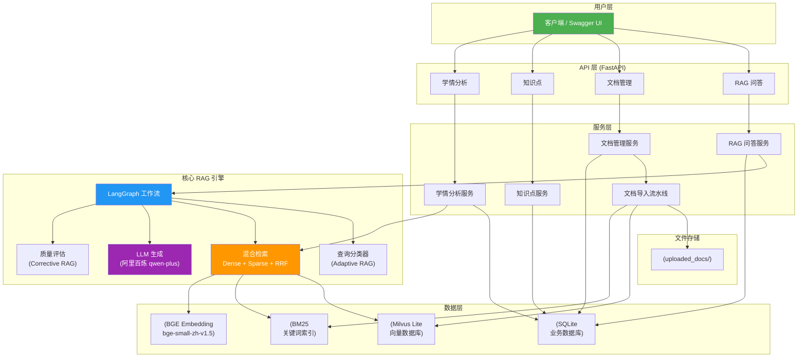
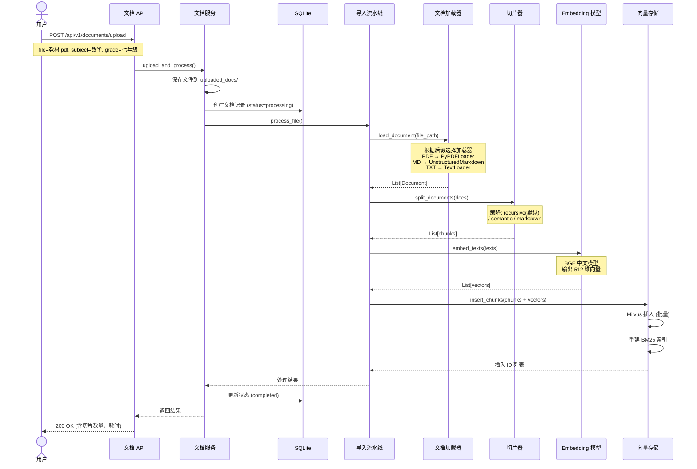
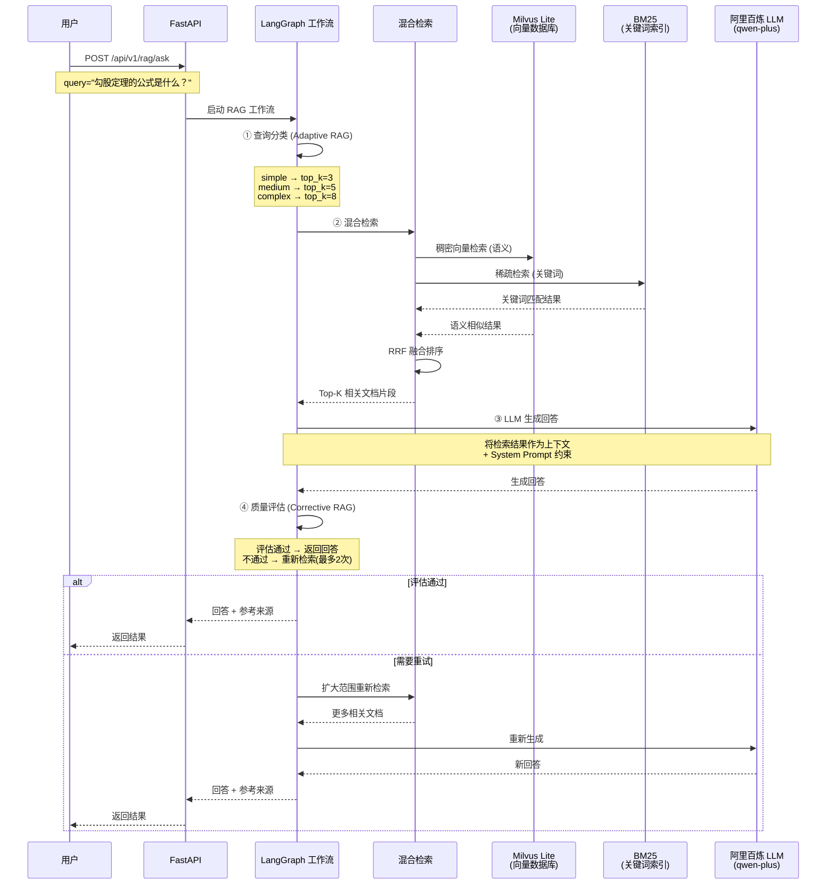
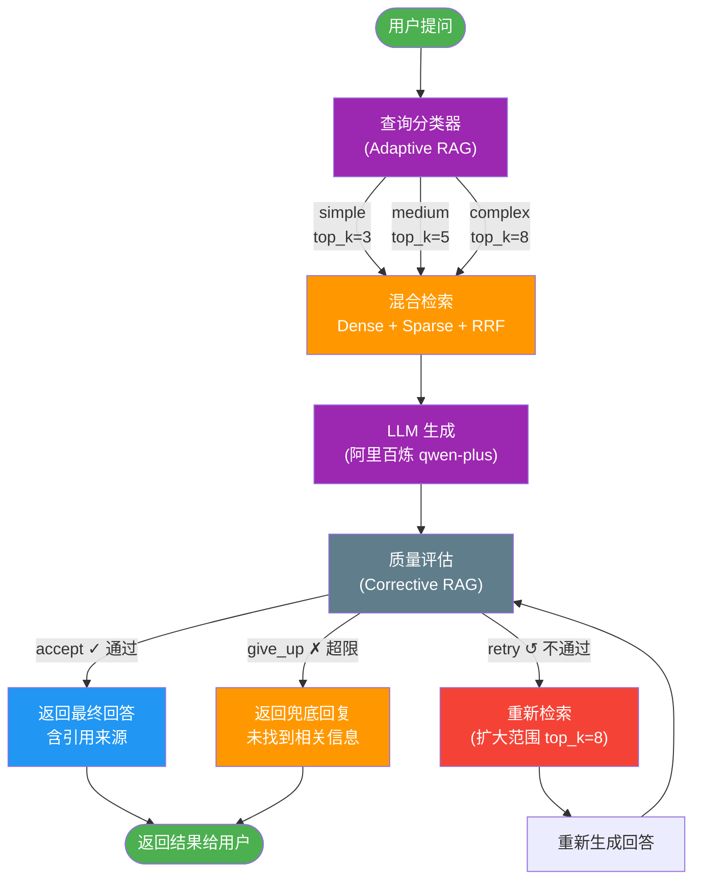

# K12 教育 RAG 系统

基于 **LangGraph + Milvus Lite + BGE Embedding + 阿里百炼 LLM** 的 K12 教育知识库智能问答系统。

---

## 目录

- [项目概述](#项目概述)
- [技术栈](#技术栈)
- [本地启动](#本地启动)
- [项目结构](#项目结构)
- [完整代码](#完整代码)
- [核心原理](#核心原理)
- [面试常见问题](#面试常见问题)

---

## 项目概述

### 解决什么问题

K12 教育场景中，学生和教师面对大量教材、教辅、试题文档，传统搜索（Elasticsearch、数据库 LIKE 查询）无法理解语义。比如搜"勾股定理的公式是什么"，如果文档里写的是"直角三角形两直角边的平方和等于斜边的平方"，传统搜索就匹配不到。

RAG（Retrieval-Augmented Generation，检索增强生成）的方案是：先把教材文档向量化存到向量数据库，用户提问时，把问题也转成向量，去向量库找最相似的片段，然后把这些片段作为上下文交给大模型，让大模型基于这些材料回答。这样既利用了 LLM 的理解和生成能力，又保证了回答内容来自私有教材，不会胡编乱造。

### 技术亮点

| 特性 | 说明 |
|------|------|
| **混合检索** | 稠密向量（语义）+ 稀疏向量（关键词）双路检索，RRF 算法融合结果 |
| **Adaptive RAG** | 根据问题复杂度动态调整检索策略，简单问题快，复杂问题深 |
| **Corrective RAG** | 自动评估生成质量，不合格则重新检索再生成，最多重试 2 次 |
| **LangGraph 编排** | 用有向图定义 RAG 流程，每个环节是独立节点，便于扩展 |
| **Milvus Lite** | 向量数据库的轻量版，单文件存储，无需部署服务器 |

---

## 系统架构



### 文档导入流程



---

## 技术栈

| 组件 | 选型 | 说明 |
|------|------|------|
| **编程语言** | Python 3.13 | 异步支持好，AI 生态最丰富 |
| **Web 框架** | FastAPI | 高性能异步框架，自带 Swagger 文档 |
| **流程编排** | LangGraph | 用图结构编排 RAG 多步骤流程 |
| **向量数据库** | Milvus Lite | 轻量级向量数据库，单文件存储 |
| **Embedding 模型** | BAAI/bge-small-zh-v1.5 | 中文语义向量模型，512 维 |
| **LLM** | 阿里百炼 qwen-plus | 兼容 OpenAI API，国内访问稳定 |
| **文档解析** | Unstructured + PyPDF | PDF/MD/TXT 解析 |
| **文本切分** | LangChain Text Splitters | 递归/语义/Markdown 多种切分策略 |
| **BM25 检索** | rank_bm25 | 本地关键词检索，与向量检索互补 |
| **数据库** | SQLite + SQLAlchemy | 存储业务数据（文档记录、问答历史等） |

### 关键依赖包详解

面试中可能会被问到"为什么选这个包"，下面是核心依赖的作用：

**pymilvus（含 milvus-lite）**
向量数据库的 Python SDK。Milvus Lite 是其轻量模式，数据存在本地文件（如 `milvus_k12.db`），无需安装 Docker 或单独的数据库服务。支持 FLAT、IVF_FLAT 等索引类型，支持余弦相似度等向量检索。

**langchain / langchain-core / langchain-community**
LangChain 生态的核心包。提供 Document 数据结构、Embedding 封装、文本切分器等基础能力。本项目的 Embedding 调用和文档处理依赖它。

**langchain-milvus**
LangChain 和 Milvus 的桥梁。不过本项目为了精细控制（混合检索 + RRF 融合），直接使用 pymilvus 的底层 API，没有用这个包的封装。

**sentence-transformers**
加载 BGE 等预训练 Embedding 模型的引擎。将文本转换成固定维度的向量，用于语义检索。

**rank_bm25**
BM25 算法的 Python 实现。BM25 是经典的关键词检索算法，是 TF-IDF 的改进版。在本项目中与稠密向量检索互补（稠密找语义相似的，BM25 找关键词匹配的），然后通过 RRF 算法融合结果。

**unstructured**
文档解析库，支持 PDF（含 OCR）、Word、Markdown 等多种格式。比 PyPDF 更强大，能识别文档结构（标题、段落、表格）。

**httpx**
异步 HTTP 客户端。用来调用 LLM API（阿里百炼的 /chat/completions 接口）。

---

## 本地启动

### 前置条件

- Python 3.11+
- 阿里百炼 API Key（在 https://bailian.console.aliyun.com 获取）

### 启动步骤

```bash
# 1. 克隆项目
cd rag2

# 2. 创建虚拟环境
python -m venv .venv

# 3. 激活虚拟环境
# macOS/Linux:
source .venv/bin/activate
# Windows:
# .venv\Scripts\activate

# 4. 安装依赖
pip install -r requirements.txt

# 5. 配置环境变量（编辑 .env 文件）
#    主要把 LLM_API_KEY 改成你在阿里百炼的 key
#    .env 文件内容如下：
#    LLM_API_KEY=sk-你的百炼key
#    LLM_BASE_URL=https://dashscope.aliyuncs.com/compatible-mode/v1
#    LLM_MODEL=qwen-plus
#    MILVUS_URI=./milvus_k12.db
#    EMBEDDING_MODEL=BAAI/bge-small-zh-v1.5
#    EMBEDDING_DEVICE=cpu
#    HF_ENDPOINT=https://hf-mirror.com
#    APP_HOST=0.0.0.0
#    APP_PORT=8000
#    LOG_LEVEL=INFO

# 6. 国内网络需要设置 HuggingFace 镜像（用于下载 Embedding 模型）
export HF_ENDPOINT=https://hf-mirror.com

# 7. 启动服务
python main.py

# 8. 打开浏览器访问
#    API 文档: http://localhost:8000/docs
#    健康检查: http://localhost:8000/health
```

### 验证服务是否正常

```bash
# 健康检查
curl http://localhost:8000/health

# 上传文档
curl -X POST http://localhost:8000/api/v1/documents/upload \
  -F "file=@教材.md" \
  -F "subject=数学" \
  -F "grade=七年级"

# 提问
curl -X POST http://localhost:8000/api/v1/rag/ask \
  -H "Content-Type: application/json" \
  -d '{"query": "一元一次方程怎么解？", "subject": "数学", "grade": "七年级"}'
```

---

## 项目结构

```
rag2/
├── main.py                         # FastAPI 应用入口，启动服务器
├── config.py                       # 全局配置，从环境变量读取
├── requirements.txt                # Python 依赖清单
├── .env                            # 环境变量配置（API Key 等）
├── .env.example                    # 环境变量模板
│
├── core/                           # 核心 RAG 引擎
│   ├── __init__.py
│   ├── embeddings.py               # Embedding 模型封装
│   ├── vectorestore.py             # 向量存储（Milvus Lite + BM25 + RRF）
│   ├── graph.py                    # LangGraph 工作流定义
│   └── nodes/                      # 工作流节点
│       ├── __init__.py
│       ├── query_classifier.py     # 查询分类（Adaptive RAG）
│       ├── retriever.py            # 混合检索
│       ├── generator.py            # LLM 生成
│       └── evaluator.py            # 质量评估（Corrective RAG）
│
├── ingestion/                      # 文档导入流水线
│   ├── __init__.py
│   ├── loader.py                   # 文档加载器
│   ├── chunker.py                  # 文本切片器
│   └── pipeline.py                 # 入库流水线
│
├── models/                         # 数据模型
│   ├── __init__.py
│   ├── schemas.py                  # Pydantic API 请求/响应模型
│   └── db_models.py                # SQLAlchemy ORM 模型
│
├── services/                       # 业务服务层
│   ├── __init__.py
│   ├── rag_service.py              # RAG 问答服务
│   ├── document_service.py         # 文档管理服务
│   ├── knowledge_service.py        # 知识点服务
│   └── analytics_service.py        # 学情分析服务
│
├── api/                            # API 接口层
│   ├── __init__.py
│   ├── rag.py                      # 问答接口
│   ├── documents.py                # 文档管理接口
│   ├── knowledge.py                # 知识点接口
│   └── analytics.py                # 学情分析接口
│
├── utils/                          # 工具
│   ├── __init__.py
│   └── logger.py                   # 日志工具
│
└── tests/                          # 测试
    ├── __init__.py
    └── test_rag.py                 # 集成测试
```

---

## 核心原理

### 1. 什么是 RAG



RAG 对比纯 LLM 的优势：
- **知识可控**：回答基于私有知识库，不是 LLM 训练数据里的内容
- **减少幻觉**：LLM 看到相关原文再回答，瞎编的概率大幅降低
- **知识更新快**：替换知识库文档即可，不用重新训练模型

### 2. 混合检索为什么好

单一检索方式有各自的缺陷：

| 检索方式 | 优点 | 缺点 |
|----------|------|------|
| 稠密向量（语义） | 理解语义，同义查询也能命中 | 对精确关键词不敏感 |
| BM25（关键词） | 精确匹配关键词 | 不理解语义，"方程"和"等式"无法关联 |

混合检索 = 两种都查 + RRF 融合结果，取长补短。

### 3. RRF 融合算法

RRF（Reciprocal Rank Fusion）的公式：

```
score(d) = Σ 1 / (k + rank_i(d))
```

其中 `rank_i(d)` 是文档 d 在第 i 路检索中的排名，k 是平滑参数（通常 60）。简单说：如果一篇文档在两路检索中排名都靠前，它的融合得分就会很高；如果只在某一路排名高，得分也不会太低。这样兼顾了两种检索方式的优势。

### 4. LangGraph 工作流



---

## 面试常见问题

### Q1: 为什么用 Milvus Lite 而不是 Milvus Standalone/Distributed？

答：Milvus Lite 是 Milvus 的轻量版，数据存在本地文件 `milvus_k12.db` 里，不需要安装 Docker 或者配置分布式集群。对于 K12 项目这种数据量不大（几万到几十万条）、并发不高的场景完全够用。上线后如果想扩展，代码完全不用改，只需要把 `MILVUS_URI` 从本地文件路径改成 Milvus Standalone 的服务地址就行，API 是兼容的。

### Q2: BM25 和向量检索的区别是什么？

答：BM25 是关键词匹配，统计查询词在文档中出现的频率和稀有程度来打分，优点是精确匹配关键词，缺点是"方程"和"等式"这种语义相近的词它认为不相关。向量检索是把文本转成向量，用余弦相似度衡量语义相似度，优点是能理解语义，缺点是可能忽略精确的关键词匹配。混合检索就是两种都用，然后用 RRF 算法把结果融合起来。

### Q3: Corrective RAG 是怎么实现的？

答：核心就是"生成 → 评估 → 纠正"的闭环。LLM 生成回答后，我们检查三个维度：检索结果的相关性得分够不够高、回答是否为空或过短、如果有重试机会是否要再试一次。如果检测到问题（比如检索得分低、回答太短），就重新检索（这次扩大检索范围）再生成一次。最多重试 2 次，如果还不行就返回"未找到相关信息"的兜底回复。

### Q4: Embedding 模型为什么选 BGE 而不是 OpenAI 的？

答：BGE（BAAI 智源研究院出品）是中文场景下最好的开源 Embedding 模型之一，bge-small-zh 只有 512 维但效果接近 large 版本，速度快很多。用开源模型的好处是：不需要调用外部 API（省钱、低延迟、不依赖网络）、数据不出本机（安全性）、可以离线部署。

---

## 完整代码清单

> 以下按文件逐个列出完整代码。建议按这个顺序阅读，从基础配置到核心逻辑再到 API 层。

### 1. requirements.txt

```
pymilvus>=2.4.2
langchain>=1.2.0
langchain-core>=1.3.0
langchain-community>=0.4.0
langchain-milvus>=0.3.0
sentence-transformers>=3.0.0
fastapi>=0.110.0
uvicorn[standard]>=0.27.0
sqlalchemy>=2.0.0
aiosqlite>=0.20.0
python-multipart>=0.0.6
rank_bm25>=0.2.0
httpx>=0.27.0
python-dotenv>=1.0.0
unstructured[pdf,md]>=0.12.0
pypdf>=4.0.0
```

安装方式：`pip install -r requirements.txt`

### 2. .env

```ini
# LLM 配置（兼容 OpenAI API 格式的服务均可）
# 阿里百炼: https://bailian.console.aliyun.com 获取 API Key
LLM_API_KEY=sk-你的百炼key
LLM_BASE_URL=https://dashscope.aliyuncs.com/compatible-mode/v1
LLM_MODEL=qwen-plus

# Milvus 配置（Lite 模式：本地文件路径）
MILVUS_URI=./milvus_k12.db

# Embedding 模型配置
# 可选: BAAI/bge-large-zh-v1.5 (1024维), BAAI/bge-small-zh-v1.5 (512维, 速度更快)
EMBEDDING_MODEL=BAAI/bge-small-zh-v1.5
EMBEDDING_DEVICE=cpu

# HuggingFace 镜像（国内网络需要配置）
HF_ENDPOINT=https://hf-mirror.com

# 应用配置
APP_HOST=0.0.0.0
APP_PORT=8000
LOG_LEVEL=INFO
```

### 3. config.py

```python
"""全局配置文件：从环境变量和 .env 文件中读取配置"""

import os
from dotenv import load_dotenv

load_dotenv()

# 国内 HuggingFace 镜像配置
if os.getenv("HF_ENDPOINT"):
    os.environ["HF_ENDPOINT"] = os.getenv("HF_ENDPOINT")


class Settings:
    # ---------- LLM 配置（兼容 OpenAI API 格式）----------
    LLM_API_KEY: str = os.getenv("LLM_API_KEY", "")
    LLM_BASE_URL: str = os.getenv("LLM_BASE_URL", "https://dashscope.aliyuncs.com/compatible-mode/v1")
    LLM_MODEL: str = os.getenv("LLM_MODEL", "qwen-plus")

    # ---------- Milvus Lite 配置 ----------
    MILVUS_URI: str = os.getenv("MILVUS_URI", "./milvus_k12.db")

    # ---------- Embedding 配置 ----------
    EMBEDDING_MODEL: str = os.getenv("EMBEDDING_MODEL", "BAAI/bge-small-zh-v1.5")
    EMBEDDING_DEVICE: str = os.getenv("EMBEDDING_DEVICE", "cpu")

    # ---------- 应用配置 ----------
    APP_HOST: str = os.getenv("APP_HOST", "0.0.0.0")
    APP_PORT: int = int(os.getenv("APP_PORT", "8000"))
    LOG_LEVEL: str = os.getenv("LOG_LEVEL", "INFO")

    # ---------- 检索参数 ----------
    TOP_K: int = 5
    CHUNK_SIZE: int = 512
    CHUNK_OVERLAP: int = 64
    RRF_K: int = 60
    DENSE_WEIGHT: float = 0.7
    SPARSE_WEIGHT: float = 0.3

    # ---------- 纠正重试 ----------
    MAX_RETRIES: int = 2

    # ---------- Milvus 集合名称 ----------
    MILVUS_COLLECTION: str = "k12_knowledge_base"

    # ---------- SQLite 数据库路径 ----------
    DATABASE_URL: str = f"sqlite+aiosqlite:///{os.path.dirname(os.path.abspath(__file__))}/k12_business.db"


settings = Settings()
```

### 4. utils/logger.py

```python
"""日志工具模块：统一日志输出格式"""

import logging
import sys
from config import settings


def setup_logger(name: str = "k12_rag") -> logging.Logger:
    """创建并返回一个配置好的日志器"""
    logger = logging.getLogger(name)
    logger.setLevel(getattr(logging, settings.LOG_LEVEL.upper(), logging.INFO))

    if not logger.handlers:
        handler = logging.StreamHandler(sys.stdout)
        handler.setLevel(logging.DEBUG)

        formatter = logging.Formatter(
            fmt="%(asctime)s | %(levelname)-7s | %(name)s | %(filename)s:%(lineno)d | %(message)s",
            datefmt="%Y-%m-%d %H:%M:%S",
        )
        handler.setFormatter(formatter)
        logger.addHandler(handler)

    return logger


logger = setup_logger()
```

### 5. core/embeddings.py

```python
"""Embedding 模型封装模块：使用 BGE 中文模型生成文本向量"""

from langchain_community.embeddings import HuggingFaceBgeEmbeddings
from utils.logger import logger
from config import settings


_embedding_model = None


def get_embedding_model() -> HuggingFaceBgeEmbeddings:
    """获取 BGE Embedding 模型单例"""
    global _embedding_model
    if _embedding_model is not None:
        return _embedding_model

    logger.info(f"正在加载 Embedding 模型: {settings.EMBEDDING_MODEL}")
    logger.info(f"使用设备: {settings.EMBEDDING_DEVICE}")

    model_kwargs = {"device": settings.EMBEDDING_DEVICE}
    encode_kwargs = {"normalize_embeddings": True}

    try:
        _embedding_model = HuggingFaceBgeEmbeddings(
            model_name=settings.EMBEDDING_MODEL,
            model_kwargs=model_kwargs,
            encode_kwargs=encode_kwargs,
            query_instruction="为这个句子生成表示以用于检索相关文章：",
        )
        logger.info(f"Embedding 模型加载成功")
    except Exception as e:
        logger.error(f"Embedding 模型加载失败: {e}")
        raise

    return _embedding_model


def get_embedding_dim() -> int:
    """获取 Embedding 模型的输出向量维度"""
    model = get_embedding_model()
    test_vec = model.embed_query("测试")
    return len(test_vec)


def embed_texts(texts: list[str]) -> list[list[float]]:
    """将文本列表批量转换为向量"""
    model = get_embedding_model()
    logger.debug(f"正在对 {len(texts)} 条文本进行向量化")
    vectors = model.embed_documents(texts)
    logger.debug(f"向量化完成，向量维度: {len(vectors[0]) if vectors else 0}")
    return vectors


def embed_query(text: str) -> list[float]:
    """将查询文本转换为向量"""
    model = get_embedding_model()
    logger.debug(f"正在对查询进行向量化: {text[:50]}...")
    vector = model.embed_query(text)
    return vector
```

### 6. core/vectorestore.py

```python
"""向量存储模块：Milvus Lite（稠密向量）+ 本地 BM25（稀疏检索）混合存储

BM25 内置函数在 Milvus Lite 中不可用（需要 Standalone/Distributed），
因此我们在本地实现 BM25 检索，再与 Milvus 的稠密检索结果做 RRF 融合。
"""

import re
import numpy as np
from rank_bm25 import BM25Okapi
from pymilvus import MilvusClient, DataType
from collections import defaultdict

from config import settings
from core.embeddings import get_embedding_model, embed_texts, embed_query, get_embedding_dim
from utils.logger import logger


class K12VectorStore:
    """
    K12 混合向量存储：
    - 稠密检索：Milvus Lite（ANN 搜索）
    - 稀疏检索：本地 BM25（关键词搜索）
    - 融合策略：RRF（倒数排名融合）
    """

    def __init__(self):
        self.embedding_model = get_embedding_model()
        self.embedding_dim = get_embedding_dim()

        # Milvus Lite 客户端
        logger.info(f"初始化 Milvus Lite，数据文件: {settings.MILVUS_URI}")
        self.milvus_client = MilvusClient(settings.MILVUS_URI)
        self._init_collection()

        # 本地 BM25 组件
        self.bm25: BM25Okapi | None = None
        self.bm25_docs: list[dict] = []
        self.bm25_corpus: list[list[str]] = []

        logger.info(f"K12VectorStore 初始化完成，向量维度: {self.embedding_dim}")

    # ==================== Milvus 集合管理 ====================

    def _init_collection(self):
        """初始化或加载 Milvus 集合"""
        collection_name = settings.MILVUS_COLLECTION
        if self.milvus_client.has_collection(collection_name):
            logger.info(f"集合 '{collection_name}' 已存在，直接加载")
            self.milvus_client.load_collection(collection_name)
            self._ensure_index()
            return

        logger.info(f"正在创建集合: {collection_name}")

        schema = MilvusClient.create_schema(auto_id=True, enable_dynamic_field=True)
        schema.add_field("id", DataType.INT64, is_primary=True, auto_id=True)
        schema.add_field("vector", DataType.FLOAT_VECTOR, dim=self.embedding_dim)
        schema.add_field("doc_id", DataType.VARCHAR, max_length=64)
        schema.add_field("chunk_text", DataType.VARCHAR, max_length=8192)
        schema.add_field("subject", DataType.VARCHAR, max_length=32)
        schema.add_field("grade", DataType.VARCHAR, max_length=32)
        schema.add_field("chapter", DataType.VARCHAR, max_length=128)
        schema.add_field("knowledge_point", DataType.VARCHAR, max_length=128)
        schema.add_field("chunk_type", DataType.VARCHAR, max_length=32)

        self.milvus_client.create_collection(collection_name=collection_name, schema=schema)
        self._ensure_index()
        logger.info(f"集合 '{collection_name}' 创建成功")

    def _ensure_index(self):
        """确保向量字段上有索引"""
        collection_name = settings.MILVUS_COLLECTION
        try:
            existing = self.milvus_client.list_indexes(collection_name)
            if existing:
                return
        except Exception:
            pass

        index_params = self.milvus_client.prepare_index_params()
        index_params.add_index(
            field_name="vector",
            index_type="IVF_FLAT",
            metric_type="COSINE",
            params={"nlist": 128},
        )
        self.milvus_client.create_index(
            collection_name=collection_name,
            index_params=index_params,
        )
        logger.info("向量索引创建成功")

    # ==================== 数据插入 ====================

    def insert_chunks(self, chunks: list[dict]) -> list[int]:
        """将切片列表插入向量存储"""
        if not chunks:
            logger.warning("插入的切片列表为空")
            return []

        collection_name = settings.MILVUS_COLLECTION
        logger.info(f"正在插入 {len(chunks)} 个切片到 Milvus")

        # 批量生成向量
        texts = [c["text"] for c in chunks]
        vectors = embed_texts(texts)

        # 准备插入数据
        data = []
        for i, (chunk, vec) in enumerate(zip(chunks, vectors)):
            data.append({
                "vector": vec,
                "doc_id": chunk.get("doc_id", ""),
                "chunk_text": chunk["text"],
                "subject": chunk.get("subject", ""),
                "grade": chunk.get("grade", ""),
                "chapter": chunk.get("chapter", ""),
                "knowledge_point": chunk.get("knowledge_point", ""),
                "chunk_type": chunk.get("chunk_type", "text"),
            })

        ids = self.milvus_client.insert(collection_name=collection_name, data=data)
        logger.info(f"Milvus 插入完成，共 {len(ids)} 条")

        # 同步更新 BM25 索引
        self._rebuild_bm25_index()
        return ids

    def _rebuild_bm25_index(self):
        """从 Milvus 读取所有数据，重建 BM25 索引"""
        logger.info("正在重建 BM25 索引...")
        collection_name = settings.MILVUS_COLLECTION

        try:
            result = self.milvus_client.query(
                collection_name=collection_name,
                filter="",
                output_fields=["id", "chunk_text", "subject", "grade", "chapter", "knowledge_point"],
                limit=10000,
            )
        except Exception as e:
            logger.warning(f"查询 Milvus 数据失败: {e}")
            self.bm25_docs = []
            self.bm25_corpus = []
            self.bm25 = None
            return

        if not result:
            self.bm25_docs = []
            self.bm25_corpus = []
            self.bm25 = None
            return

        self.bm25_docs = result
        self.bm25_corpus = [self._tokenize(doc["chunk_text"]) for doc in result]
        self.bm25 = BM25Okapi(self.bm25_corpus)
        logger.info(f"BM25 索引重建完成，共 {len(result)} 篇文档")

    @staticmethod
    def _tokenize(text: str) -> list[str]:
        """
        简单中文分词，使用二元组（bigram）方式。
        实际项目可以替换为 jieba 分词以获得更好效果。
        """
        tokens = re.findall(r"[\w]+", text)
        result = []
        for token in tokens:
            if len(token) <= 2:
                result.append(token)
            else:
                for i in range(len(token) - 1):
                    result.append(token[i:i+2])
        return result

    # ==================== 混合检索 ====================

    def hybrid_search(
        self,
        query: str,
        subject: str | None = None,
        grade: str | None = None,
        top_k: int = 5,
    ) -> list[dict]:
        """
        混合检索：稠密向量 + 稀疏 BM25，RRF 融合。
        返回按相关性降序排列的文档列表。
        """
        logger.info(f"混合检索: query='{query[:50]}', subject={subject}, grade={grade}")

        # 构建 Milvus 过滤条件
        filters = []
        if subject:
            filters.append(f"subject == '{subject}'")
        if grade:
            filters.append(f"grade == '{grade}'")
        filter_str = " and ".join(filters) if filters else ""

        # 双路检索
        dense_results = self._dense_search(query, filter_str, top_k)
        sparse_results = self._sparse_search(query, filter_str, top_k)

        logger.debug(f"稠密={len(dense_results)}条, 稀疏={len(sparse_results)}条")

        # RRF 融合
        if not dense_results and not sparse_results:
            return []
        if not dense_results:
            return sparse_results[:top_k]
        if not sparse_results:
            return dense_results[:top_k]

        return self._rrf_fusion(dense_results, sparse_results, top_k)

    def _dense_search(self, query: str, filter_str: str, top_k: int) -> list[dict]:
        """Milvus 稠密向量 ANN 搜索"""
        query_vec = embed_query(query)
        collection_name = settings.MILVUS_COLLECTION

        results = self.milvus_client.search(
            collection_name=collection_name,
            data=[query_vec],
            filter=filter_str or None,
            limit=top_k,
            output_fields=["chunk_text", "doc_id", "subject", "grade", "chapter", "knowledge_point"],
            search_params={"metric_type": "COSINE", "params": {"ef": 64}},
        )

        if not results or not results[0]:
            return []

        docs = []
        for hit in results[0]:
            docs.append({
                "id": hit["id"],
                "text": hit["entity"]["chunk_text"],
                "score": hit["distance"],
                "doc_id": hit["entity"].get("doc_id", ""),
                "subject": hit["entity"].get("subject", ""),
                "grade": hit["entity"].get("grade", ""),
                "chapter": hit["entity"].get("chapter", ""),
                "knowledge_point": hit["entity"].get("knowledge_point", ""),
                "_source": "dense",
            })
        return docs

    def _sparse_search(self, query: str, filter_str: str, top_k: int) -> list[dict]:
        """本地 BM25 稀疏检索"""
        if not self.bm25 or not self.bm25_docs:
            return []

        query_tokens = self._tokenize(query)
        scores = self.bm25.get_scores(query_tokens)

        top_indices = np.argsort(scores)[::-1][:top_k]
        results = []
        for idx in top_indices:
            if scores[idx] <= 0:
                continue
            doc = self.bm25_docs[idx]
            # 简易元数据过滤
            if filter_str:
                if "subject" in filter_str and doc.get("subject", "") not in filter_str:
                    continue
                if "grade" in filter_str and doc.get("grade", "") not in filter_str:
                    continue
            results.append({
                "id": doc.get("id", 0),
                "text": doc.get("chunk_text", ""),
                "score": float(scores[idx]),
                "doc_id": doc.get("doc_id", ""),
                "subject": doc.get("subject", ""),
                "grade": doc.get("grade", ""),
                "chapter": doc.get("chapter", ""),
                "knowledge_point": doc.get("knowledge_point", ""),
                "_source": "sparse",
            })
        return results

    def _rrf_fusion(self, dense_results: list[dict], sparse_results: list[dict], top_k: int) -> list[dict]:
        """
        RRF（倒数排名融合）算法：
        score(d) = Σ 1 / (k + rank_i(d))
        k=60 是平滑参数，rank_i(d) 是文档 d 在第 i 路检索中的排名
        """
        k = settings.RRF_K
        score_map = defaultdict(float)

        for rank, doc in enumerate(dense_results):
            doc_id = doc["id"]
            score_map[doc_id] += 1.0 / (k + rank + 1)
            score_map[f"_{doc_id}_data"] = doc

        for rank, doc in enumerate(sparse_results):
            doc_id = doc["id"]
            score_map[doc_id] += 1.0 / (k + rank + 1)
            if f"_{doc_id}_data" not in score_map:
                score_map[f"_{doc_id}_data"] = doc

        # 按融合得分排序
        scored_docs = []
        for doc_id in score_map:
            if isinstance(doc_id, int) or (isinstance(doc_id, str) and doc_id.isdigit()):
                doc_id_num = int(doc_id)
                doc_data = score_map.get(f"_{doc_id_num}_data", {})
                if doc_data:
                    scored_docs.append((score_map[doc_id_num], doc_data))

        scored_docs.sort(key=lambda x: x[0], reverse=True)

        max_score = scored_docs[0][0] if scored_docs else 1
        results = []
        for score, doc in scored_docs[:top_k]:
            doc["score"] = round(score / max_score, 4)
            results.append(doc)

        return results

    def delete_by_doc_id(self, doc_id: str):
        """根据 doc_id 删除所有相关切片"""
        collection_name = settings.MILVUS_COLLECTION
        logger.info(f"删除 doc_id={doc_id} 的切片")
        self.milvus_client.delete(collection_name=collection_name, filter=f"doc_id == '{doc_id}'")
        self._rebuild_bm25_index()

    @property
    def collection_stats(self) -> dict:
        """获取集合统计信息"""
        collection_name = settings.MILVUS_COLLECTION
        stats = self.milvus_client.get_collection_stats(collection_name)
        return {"row_count": stats.get("row_count", 0)}
```

### 7. core/nodes/query_classifier.py

```python
"""
Adaptive RAG 查询分类节点
根据查询长度和关键词将问题分为三类，决定后续检索策略：
- simple: 事实性问题，检索 top_k=3，快速回答
- medium: 一般问题，检索 top_k=5
- complex: 需要比较/分析的问题，检索 top_k=8
"""

from typing import Literal
from utils.logger import logger

_SIMPLE_KEYWORDS = ["是什么", "什么是", "定义", "公式", "定理", "等于", "多少"]
_COMPLEX_KEYWORDS = ["比较", "对比", "区别", "异同", "关系", "分析", "为什么", "原理", "推导"]


def classify_query(query: str) -> Literal["simple", "medium", "complex"]:
    query_lower = query.strip().lower()
    query_len = len(query)

    logger.info(f"查询分类: query='{query[:50]}', 长度={query_len}")

    # 复杂查询：包含分析/比较类关键词且长度>15
    if any(kw in query_lower for kw in _COMPLEX_KEYWORDS) and query_len > 15:
        return "complex"

    # 简单查询：包含定义类关键词或长度很短
    if any(kw in query_lower for kw in _SIMPLE_KEYWORDS) or query_len < 10:
        return "simple"

    return "medium"
```

### 8. core/nodes/retriever.py

```python
"""检索节点：根据查询复杂度执行不同深度的混合检索"""

from core.vectorestore import K12VectorStore
from utils.logger import logger


def hybrid_retrieve(
    vector_store: K12VectorStore,
    query: str,
    complexity: str,
    subject: str | None = None,
    grade: str | None = None,
) -> list[dict]:
    """
    simple → top_k=3（快）
    medium → top_k=5（标准）
    complex → top_k=8（深，获取更多上下文）
    """
    top_k_map = {"simple": 3, "medium": 5, "complex": 8}
    top_k = top_k_map.get(complexity, 5)

    logger.info(f"检索节点: complexity={complexity}, top_k={top_k}")
    docs = vector_store.hybrid_search(query=query, subject=subject, grade=grade, top_k=top_k)
    logger.info(f"检索完成，获取到 {len(docs)} 篇相关文档")

    return docs
```

### 9. core/nodes/generator.py

```python
"""生成节点：基于检索结果，调用 LLM 生成回答（阿里百炼 qwen 系列）"""

import httpx
from config import settings
from utils.logger import logger


SYSTEM_PROMPT = """你是一个专业的 K12 教育助手，名叫"知学助手"。
请根据以下提供的参考资料，回答学生的问题。

## 要求
1. 仅基于参考资料中的内容回答，不要编造事实
2. 如果参考资料不足以回答问题，请明确说明"参考资料中未找到相关信息"
3. 回答要简明易懂，适合 K12 学生的认知水平
4. 适当举例说明，帮助理解
5. 在回答末尾标注引用的参考来源序号（如 [1][2]）

## 参考资料
{context}

## 问题
{query}"""


async def llm_generate(query: str, context_docs: list[dict]) -> str:
    """
    调用阿里百炼 LLM 生成回答。
    使用 httpx 调用兼容 OpenAI API 格式的 /chat/completions 接口。
    """
    if not settings.LLM_API_KEY:
        logger.warning("未配置 LLM_API_KEY，使用模拟回答模式")
        return _mock_answer(query, context_docs)

    # 组装检索到的上下文
    context_parts = [f"[{i+1}] {doc['text']}" for i, doc in enumerate(context_docs)]
    context = "\n\n".join(context_parts)

    messages = [
        {"role": "system", "content": SYSTEM_PROMPT.format(context=context, query=query)},
        {"role": "user", "content": query},
    ]

    logger.info(f"调用 LLM: model={settings.LLM_MODEL}, docs={len(context_docs)}")

    try:
        async with httpx.AsyncClient(timeout=60.0) as client:
            response = await client.post(
                f"{settings.LLM_BASE_URL}/chat/completions",
                headers={
                    "Authorization": f"Bearer {settings.LLM_API_KEY}",
                    "Content-Type": "application/json",
                },
                json={
                    "model": settings.LLM_MODEL,
                    "messages": messages,
                    "temperature": 0.3,
                    "max_tokens": 2048,
                },
            )
            response.raise_for_status()
            result = response.json()
            answer = result["choices"][0]["message"]["content"]
            logger.info(f"LLM 回答生成完成，长度: {len(answer)} 字符")
            return answer

    except httpx.HTTPStatusError as e:
        logger.error(f"LLM API 返回错误: {e.response.status_code} {e.response.text[:200]}")
        return _mock_answer(query, context_docs)
    except Exception as e:
        logger.error(f"LLM 调用异常: {e}")
        return _mock_answer(query, context_docs)


def _mock_answer(query: str, context_docs: list[dict]) -> str:
    """未配置 API Key 时的模拟回答"""
    if not context_docs:
        return "抱歉，未找到与该问题相关的参考资料。"

    parts = [f"根据检索到的资料，以下是与「{query}」相关的信息：\n"]
    for i, doc in enumerate(context_docs[:3]):
        parts.append(f"[{i+1}] {doc['text'][:200]}")

    parts.append(f"\n（共检索到 {len(context_docs)} 条相关记录，请配置 LLM_API_KEY 以启用智能生成）")
    return "\n\n".join(parts)
```

### 10. core/nodes/evaluator.py

```python
"""
评估节点：Corrective RAG 的质量评估
判断回答是否合格，不合格则触发重试流程
"""

from typing import Literal
from utils.logger import logger


def evaluate_quality(
    query: str,
    answer: str,
    retrieved_docs: list[dict],
    retry_count: int,
    max_retries: int = 2,
) -> tuple[Literal["accept", "retry", "give_up"], str]:
    """
    评估回答质量的三个维度：
    1. 是否有检索结果
    2. 回答是否非空（长度 >= 5）
    3. 检索结果的最高相关性得分是否 >= 0.4
    """
    logger.info(f"质量评估: retry_count={retry_count}/{max_retries}")

    # 无检索结果 → 无法回答
    if not retrieved_docs:
        return "give_up", "未检索到相关文档"

    # 回答过短 → 重试
    if not answer or len(answer.strip()) < 5:
        if retry_count < max_retries:
            return "retry", "回答内容为空或过短"
        return "give_up", "多次尝试后仍无法生成有效回答"

    # 检索相关性低 → 重试（扩大检索范围）
    max_score = max(doc.get("score", 0) for doc in retrieved_docs)
    if max_score < 0.4 and retry_count < max_retries:
        return "retry", f"检索结果相关性不足 (最高分: {max_score:.3f})"

    # 通过
    return "accept", "回答质量合格"


def decide_next_step(evaluation_result: tuple) -> str:
    return evaluation_result[0]
```

### 11. core/graph.py

```python
"""
LangGraph 工作流：用有向图编排 RAG 流程

流程: classify → retrieve → generate → evaluate
                                         │
                                    ┌────┴────┐
                                    │         │
                                  accept    retry → re_retrieve → generate
                                    │
                                  give_up
"""

from typing import TypedDict, Literal
from langgraph.graph import StateGraph, END

from core.nodes.query_classifier import classify_query
from core.nodes.retriever import hybrid_retrieve
from core.nodes.generator import llm_generate
from core.nodes.evaluator import evaluate_quality, decide_next_step
from core.vectorestore import K12VectorStore
from utils.logger import logger


class RAGState(TypedDict):
    query: str
    subject: str | None
    grade: str | None
    complexity: str                # simple / medium / complex
    retrieved_docs: list
    answer: str
    evaluation_reason: str
    retry_count: int
    max_retries: int


# ==================== 节点函数 ====================

async def classify_node(state: RAGState) -> dict:
    complexity = classify_query(state["query"])
    return {"complexity": complexity}


async def retrieve_node(state: RAGState) -> dict:
    vector_store: K12VectorStore = state.get("_vector_store")
    docs = hybrid_retrieve(
        vector_store=vector_store,
        query=state["query"],
        complexity=state["complexity"],
        subject=state.get("subject"),
        grade=state.get("grade"),
    )
    return {"retrieved_docs": docs}


async def generate_node(state: RAGState) -> dict:
    answer = await llm_generate(query=state["query"], context_docs=state.get("retrieved_docs", []))
    return {"answer": answer}


async def evaluate_node(state: RAGState) -> dict:
    decision, reason = evaluate_quality(
        query=state["query"],
        answer=state.get("answer", ""),
        retrieved_docs=state.get("retrieved_docs", []),
        retry_count=state.get("retry_count", 0),
        max_retries=state.get("max_retries", 2),
    )
    return {"evaluation_reason": reason}


async def re_retrieve_node(state: RAGState) -> dict:
    """重试检索：增加检索深度（强制使用 complex 策略）"""
    vector_store: K12VectorStore = state.get("_vector_store")
    docs = hybrid_retrieve(
        vector_store=vector_store,
        query=state["query"],
        complexity="complex",
        subject=state.get("subject"),
        grade=state.get("grade"),
    )
    return {"retrieved_docs": docs, "retry_count": state.get("retry_count", 0) + 1}


# ==================== 条件边 ====================

def should_continue(state: RAGState) -> Literal["accept", "retry", "give_up"]:
    reason = state.get("evaluation_reason", "")
    if "合格" in reason:
        return "accept"
    elif "重试" in reason and state.get("retry_count", 0) < state.get("max_retries", 2):
        return "retry"
    else:
        return "give_up"


# ==================== 构建图 ====================

def build_rag_graph(vector_store: K12VectorStore):
    """
    构建 LangGraph RAG 工作流。
    通过闭包将 vector_store 注入到 retrieve 和 re_retrieve 节点中。
    """
    logger.info("正在构建 LangGraph RAG 工作流...")

    async def retrieve_with_store(state: RAGState) -> dict:
        state["_vector_store"] = vector_store
        return await retrieve_node(state)

    async def re_retrieve_with_store(state: RAGState) -> dict:
        state["_vector_store"] = vector_store
        return await re_retrieve_node(state)

    workflow = StateGraph(RAGState)

    workflow.add_node("classify", classify_node)
    workflow.add_node("retrieve", retrieve_with_store)
    workflow.add_node("generate", generate_node)
    workflow.add_node("evaluate", evaluate_node)
    workflow.add_node("re_retrieve", re_retrieve_with_store)

    workflow.set_entry_point("classify")

    workflow.add_edge("classify", "retrieve")
    workflow.add_edge("retrieve", "generate")
    workflow.add_edge("generate", "evaluate")

    # 条件边：根据评估结果路由
    workflow.add_conditional_edges(
        "evaluate",
        should_continue,
        {
            "accept": END,
            "retry": "re_retrieve",
            "give_up": END,
        },
    )
    workflow.add_edge("re_retrieve", "generate")

    app = workflow.compile()
    logger.info("LangGraph RAG 工作流构建完成")
    return app
```

### 12. ingestion/loader.py

```python
"""文档加载模块：支持 PDF、Markdown、TXT 格式"""

import os
from langchain_community.document_loaders import PyPDFLoader, TextLoader
from langchain_community.document_loaders import UnstructuredMarkdownLoader
from langchain_core.documents import Document
from utils.logger import logger


def load_document(file_path: str) -> list[Document]:
    """根据文件扩展名自动选择加载器"""
    ext = os.path.splitext(file_path)[1].lower()
    logger.info(f"正在加载文档: {file_path} (类型: {ext})")

    if ext == ".pdf":
        return _load_pdf(file_path)
    elif ext == ".md":
        return _load_markdown(file_path)
    elif ext == ".txt":
        return _load_text(file_path)
    else:
        raise ValueError(f"不支持的文件类型: {ext}，仅支持 PDF/MD/TXT")


def _load_pdf(file_path: str) -> list[Document]:
    loader = PyPDFLoader(file_path)
    docs = loader.load()
    for doc in docs:
        doc.metadata["source_file"] = os.path.basename(file_path)
        doc.metadata["file_type"] = "pdf"
    return docs


def _load_markdown(file_path: str) -> list[Document]:
    loader = UnstructuredMarkdownLoader(file_path, mode="elements")
    docs = loader.load()
    for doc in docs:
        doc.metadata["source_file"] = os.path.basename(file_path)
        doc.metadata["file_type"] = "md"
    return docs


def _load_text(file_path: str) -> list[Document]:
    loader = TextLoader(file_path, encoding="utf-8")
    docs = loader.load()
    for doc in docs:
        doc.metadata["source_file"] = os.path.basename(file_path)
        doc.metadata["file_type"] = "txt"
    return docs
```

### 13. ingestion/chunker.py

```python
"""文档切片模块：支持递归切分、语义切分、Markdown 结构切分"""

import uuid
from langchain_text_splitters import RecursiveCharacterTextSplitter, MarkdownHeaderTextSplitter
from langchain_core.documents import Document
from config import settings
from utils.logger import logger

try:
    from langchain_experimental.text_splitter import SemanticChunker
    from core.embeddings import get_embedding_model
    _has_semantic = True
except ImportError:
    _has_semantic = False


def split_documents(
    docs: list[Document],
    subject: str = "",
    grade: str = "",
    chapter: str = "",
    strategy: str = "recursive",
) -> list[dict]:
    """将 Document 列表按策略切分，返回切片字典列表"""
    logger.info(f"开始切片: strategy={strategy}, docs={len(docs)}个")

    if strategy == "markdown":
        chunks = _split_markdown(docs)
    elif strategy == "semantic":
        chunks = _split_semantic(docs)
    else:
        chunks = _split_recursive(docs)

    doc_id = str(uuid.uuid4())
    result = []
    for i, chunk in enumerate(chunks):
        result.append({
            "text": chunk.page_content,
            "doc_id": doc_id,
            "subject": subject,
            "grade": grade,
            "chapter": chapter,
            "knowledge_point": chunk.metadata.get("knowledge_point", ""),
            "chunk_type": chunk.metadata.get("chunk_type", "text"),
            "chunk_index": i,
        })

    logger.info(f"切片完成，共 {len(result)} 个切片")
    return result


def _split_recursive(docs: list[Document]) -> list[Document]:
    """递归字符切分：适合普通文本和试题"""
    splitter = RecursiveCharacterTextSplitter(
        chunk_size=settings.CHUNK_SIZE,
        chunk_overlap=settings.CHUNK_OVERLAP,
        separators=["\n\n", "\n", "。", ".", " ", ""],
    )
    return splitter.split_documents(docs)


def _split_semantic(docs: list[Document]) -> list[Document]:
    """语义切分：适合教材正文、概念讲解"""
    if not _has_semantic:
        logger.warning("SemanticChunker 不可用，回退到递归切分")
        return _split_recursive(docs)

    embedding_model = get_embedding_model()
    splitter = SemanticChunker(embedding=embedding_model, breakpoint_threshold_type="percentile")
    chunks = []
    for doc in docs:
        chunks.extend(splitter.split_documents([doc]))
    return chunks


def _split_markdown(docs: list[Document]) -> list[Document]:
    """Markdown 标题层级切分"""
    splitter = MarkdownHeaderTextSplitter(headers_to_split_on=[
        ("#", "header1"), ("##", "header2"), ("###", "header3"),
    ])
    chunks = []
    for doc in docs:
        if doc.metadata.get("file_type") == "md":
            chunks.extend(splitter.split_text(doc.page_content))
    return chunks if chunks else _split_recursive(docs)
```

### 14. ingestion/pipeline.py

```python
"""知识库构建流水线：文档加载 → 切片 → 向量化 → 入库"""

import os
import time
from ingestion.loader import load_document
from ingestion.chunker import split_documents
from core.vectorestore import K12VectorStore
from utils.logger import logger


class IngestionPipeline:
    def __init__(self, vector_store: K12VectorStore):
        self.vector_store = vector_store

    def process_file(self, file_path: str, subject: str = "", grade: str = "",
                     chapter: str = "", strategy: str = "recursive") -> dict:
        start_time = time.time()
        file_name = os.path.basename(file_path)
        logger.info(f"========== 开始处理文件: {file_name} ==========")

        try:
            docs = load_document(file_path)
            chunks = split_documents(docs, subject=subject, grade=grade, chapter=chapter, strategy=strategy)
            if not chunks:
                return {"status": "skipped", "chunk_count": 0, "file": file_name}

            ids = self.vector_store.insert_chunks(chunks)
            elapsed = time.time() - start_time
            logger.info(f"文件处理完成: {file_name}, 耗时: {elapsed:.2f}s")
            return {"status": "success", "file": file_name, "chunk_count": len(chunks),
                    "inserted_ids": len(ids), "elapsed_seconds": round(elapsed, 2)}
        except Exception as e:
            logger.error(f"文件处理失败: {e}")
            return {"status": "error", "message": str(e), "file": file_name}
```

### 15. models/schemas.py

```python
"""Pydantic 数据模型：API 请求/响应 Schema"""

from pydantic import BaseModel, Field
from typing import Any


class AskRequest(BaseModel):
    query: str = Field(..., description="用户问题", min_length=1, max_length=2000)
    subject: str | None = Field(None, description="学科过滤")
    grade: str | None = Field(None, description="年级过滤")
    user_id: str | None = None
    stream: bool = False


class AskResponse(BaseModel):
    code: int = 0
    message: str = "success"
    data: dict[str, Any] | None = None


class DocumentUploadResponse(BaseModel):
    code: int = 0
    message: str = "success"
    data: dict | None = None


class DocumentListResponse(BaseModel):
    code: int = 0
    data: list[dict] = []
    total: int = 0


class KnowledgePointCreate(BaseModel):
    name: str = Field(..., description="知识点名称")
    subject: str = Field(..., description="所属学科")
    parent_id: str | None = None
    description: str = ""
    sort_order: int = 0
```

### 16. models/db_models.py

```python
"""SQLAlchemy ORM 模型：业务数据表"""

import uuid
from datetime import datetime
from sqlalchemy import Column, String, Integer, Float, Text, DateTime, ForeignKey, JSON
from sqlalchemy.orm import DeclarativeBase, relationship
from sqlalchemy.ext.asyncio import create_async_engine, async_sessionmaker, AsyncAttrs
from config import settings
from utils.logger import logger


class Base(AsyncAttrs, DeclarativeBase):
    pass


class Document(Base):
    __tablename__ = "documents"

    id = Column(String(64), primary_key=True, default=lambda: str(uuid.uuid4()))
    title = Column(String(256), nullable=False)
    doc_type = Column(String(32), nullable=False)
    subject = Column(String(32), nullable=False, index=True)
    grade = Column(String(32), default="", index=True)
    chapter = Column(String(128), default="")
    file_path = Column(String(512), nullable=False)
    chunk_count = Column(Integer, default=0)
    status = Column(String(16), default="pending")  # pending/processing/completed/failed
    error_message = Column(Text, default="")
    created_at = Column(DateTime, default=datetime.utcnow)
    updated_at = Column(DateTime, default=datetime.utcnow, onupdate=datetime.utcnow)


class KnowledgePoint(Base):
    __tablename__ = "knowledge_points"

    id = Column(String(64), primary_key=True, default=lambda: str(uuid.uuid4()))
    name = Column(String(128), nullable=False)
    subject = Column(String(32), nullable=False, index=True)
    parent_id = Column(String(64), ForeignKey("knowledge_points.id"), nullable=True)
    level = Column(Integer, default=0)
    description = Column(Text, default="")
    sort_order = Column(Integer, default=0)
    children = relationship("KnowledgePoint", backref="parent", remote_side=[id], lazy="selectin")


class QARecord(Base):
    __tablename__ = "qa_records"

    id = Column(String(64), primary_key=True, default=lambda: str(uuid.uuid4()))
    user_id = Column(String(64), nullable=False, index=True)
    query = Column(Text, nullable=False)
    answer = Column(Text, default="")
    subject = Column(String(32), default="")
    grade = Column(String(32), default="")
    complexity = Column(String(16), default="medium")
    retrieved_chunks = Column(JSON, default=list)
    feedback = Column(Integer, default=0)
    latency_ms = Column(Integer, default=0)
    created_at = Column(DateTime, default=datetime.utcnow)


_engine = None
_session_maker = None


def get_engine():
    global _engine
    if _engine is None:
        _engine = create_async_engine(settings.DATABASE_URL, echo=False)
    return _engine


def get_session_maker():
    global _session_maker
    if _session_maker is None:
        _session_maker = async_sessionmaker(get_engine(), expire_on_commit=False)
    return _session_maker


async def init_db():
    async with get_engine().begin() as conn:
        await conn.run_sync(Base.metadata.create_all)
    logger.info("数据库表创建完成")
```

### 17. services/rag_service.py

```python
"""RAG 问答服务：编排 LangGraph 工作流并管理会话"""

import time
from langgraph.graph.graph import CompiledGraph
from core.graph import RAGState
from core.vectorestore import K12VectorStore
from models.db_models import QARecord, get_session_maker
from utils.logger import logger


class RAGService:
    def __init__(self, vector_store: K12VectorStore, rag_graph: CompiledGraph):
        self.vector_store = vector_store
        self.rag_graph = rag_graph

    async def ask(self, query: str, subject: str | None = None, grade: str | None = None,
                  user_id: str | None = None, stream: bool = False) -> dict:
        start_time = time.time()
        logger.info(f"========== RAG 问答开始: {query[:50]} ==========")

        initial_state: RAGState = {
            "query": query, "subject": subject, "grade": grade,
            "complexity": "", "retrieved_docs": [], "answer": "",
            "evaluation_reason": "", "retry_count": 0, "max_retries": 2,
        }

        try:
            result = await self.rag_graph.ainvoke(initial_state)
        except Exception as e:
            logger.error(f"RAG 工作流执行失败: {e}")
            return {"answer": f"抱歉，回答生成过程中出现错误: {str(e)}", "references": [], "latency_ms": 0}

        elapsed = int((time.time() - start_time) * 1000)

        references = []
        for doc in result.get("retrieved_docs", []):
            references.append({
                "chunk_id": doc.get("id"),
                "text": doc.get("text", "")[:200],
                "score": round(doc.get("score", 0), 4),
                "subject": doc.get("subject", ""),
                "grade": doc.get("grade", ""),
            })

        answer = result.get("answer", "抱歉，暂时无法回答该问题。")

        # 异步保存问答记录
        if user_id:
            try:
                session_maker = get_session_maker()
                async with session_maker() as session:
                    record = QARecord(user_id=user_id, query=query, answer=answer,
                                      subject=subject or "", grade=grade or "",
                                      complexity=result.get("complexity", "medium"),
                                      retrieved_chunks=references[:5], latency_ms=elapsed)
                    session.add(record)
                    await session.commit()
            except Exception as e:
                logger.warning(f"保存问答记录失败: {e}")

        logger.info(f"RAG 流程完成，耗时: {elapsed}ms")
        return {"answer": answer, "references": references, "latency_ms": elapsed,
                "complexity": result.get("complexity", "medium")}
```

### 18. services/document_service.py

```python
"""文档管理服务"""

import os
import uuid
from models.db_models import Document, get_session_maker
from ingestion.pipeline import IngestionPipeline
from core.vectorestore import K12VectorStore
from sqlalchemy import select
from utils.logger import logger

DOCS_DIR = os.path.join(os.path.dirname(os.path.dirname(os.path.abspath(__file__))), "uploaded_docs")


class DocumentService:
    def __init__(self, vector_store: K12VectorStore):
        self.vector_store = vector_store
        self.pipeline = IngestionPipeline(vector_store)
        os.makedirs(DOCS_DIR, exist_ok=True)

    async def upload_and_process(self, file_content: bytes, filename: str,
                                  subject: str, grade: str = "", chapter: str = "",
                                  strategy: str = "recursive") -> dict:
        doc_id = str(uuid.uuid4())
        file_path = os.path.join(DOCS_DIR, f"{doc_id}_{filename}")
        with open(file_path, "wb") as f:
            f.write(file_content)

        session_maker = get_session_maker()
        async with session_maker() as session:
            doc = Document(id=doc_id, title=filename, doc_type=os.path.splitext(filename)[1].lstrip("."),
                          subject=subject, grade=grade, chapter=chapter, file_path=file_path, status="processing")
            session.add(doc)
            await session.commit()

        result = self.pipeline.process_file(file_path=file_path, subject=subject, grade=grade, chapter=chapter, strategy=strategy)

        async with session_maker() as session:
            doc = await session.get(Document, doc_id)
            if doc:
                doc.status = "completed" if result["status"] == "success" else "failed"
                doc.chunk_count = result.get("chunk_count", 0)
                if result["status"] == "error":
                    doc.error_message = result.get("message", "")
                await session.commit()

        result["doc_id"] = doc_id
        return result

    async def list_documents(self) -> list[dict]:
        session_maker = get_session_maker()
        async with session_maker() as session:
            result = await session.execute(select(Document).order_by(Document.created_at.desc()))
            docs = result.scalars().all()
            return [{"id": d.id, "title": d.title, "doc_type": d.doc_type, "subject": d.subject,
                     "grade": d.grade, "chunk_count": d.chunk_count, "status": d.status,
                     "created_at": d.created_at.isoformat() if d.created_at else ""} for d in docs]

    async def delete_document(self, doc_id: str) -> bool:
        session_maker = get_session_maker()
        async with session_maker() as session:
            doc = await session.get(Document, doc_id)
            if not doc:
                return False
            if os.path.exists(doc.file_path):
                os.remove(doc.file_path)
            self.vector_store.delete_by_doc_id(doc_id)
            await session.delete(doc)
            await session.commit()
            return True
```

### 19. services/knowledge_service.py

```python
"""知识点管理服务"""

from models.db_models import KnowledgePoint, get_session_maker
from sqlalchemy import select
from utils.logger import logger


class KnowledgeService:
    async def create_knowledge_point(self, data: dict) -> dict:
        session_maker = get_session_maker()
        async with session_maker() as session:
            level = 0
            if data.get("parent_id"):
                parent = await session.get(KnowledgePoint, data["parent_id"])
                if parent:
                    level = parent.level + 1

            kp = KnowledgePoint(name=data["name"], subject=data["subject"], parent_id=data.get("parent_id"),
                               level=level, description=data.get("description", ""), sort_order=data.get("sort_order", 0))
            session.add(kp)
            await session.commit()
            await session.refresh(kp)
            return {"id": kp.id, "name": kp.name, "subject": kp.subject, "level": kp.level}

    async def get_knowledge_tree(self, subject: str | None = None) -> list[dict]:
        session_maker = get_session_maker()
        async with session_maker() as session:
            query = select(KnowledgePoint).order_by(KnowledgePoint.sort_order)
            if subject:
                query = query.where(KnowledgePoint.subject == subject)
            result = await session.execute(query)
            all_kps = result.scalars().all()

        kp_map = {kp.id: {"id": kp.id, "name": kp.name, "subject": kp.subject,
                          "parent_id": kp.parent_id, "level": kp.level, "children": []} for kp in all_kps}
        tree = []
        for kp_id, node in kp_map.items():
            if node["parent_id"] and node["parent_id"] in kp_map:
                kp_map[node["parent_id"]]["children"].append(node)
            else:
                tree.append(node)
        return tree

    async def delete_knowledge_point(self, kp_id: str) -> bool:
        session_maker = get_session_maker()
        async with session_maker() as session:
            kp = await session.get(KnowledgePoint, kp_id)
            if not kp:
                return False
            await session.delete(kp)
            await session.commit()
            return True
```

### 20. services/analytics_service.py

```python
"""学情分析服务"""

from sqlalchemy import select, desc
from models.db_models import QARecord, get_session_maker
from core.vectorestore import K12VectorStore
from utils.logger import logger


class AnalyticsService:
    def __init__(self, vector_store: K12VectorStore):
        self.vector_store = vector_store

    async def get_weak_points(self, user_id: str, subject: str | None = None) -> list[dict]:
        """分析薄弱知识点：统计差评记录的学科分布"""
        session_maker = get_session_maker()
        async with session_maker() as session:
            query = select(QARecord).where(QARecord.user_id == user_id, QARecord.feedback == -1)
            if subject:
                query = query.where(QARecord.subject == subject)
            query = query.order_by(desc(QARecord.created_at)).limit(50)
            result = await session.execute(query)
            records = result.scalars().all()

        weak_areas = {}
        for r in records:
            subj = r.subject or "未知"
            if subj not in weak_areas:
                weak_areas[subj] = {"subject": subj, "count": 0}
            weak_areas[subj]["count"] += 1

        return sorted(weak_areas.values(), key=lambda x: x["count"], reverse=True)

    async def get_history(self, user_id: str, limit: int = 20) -> list[dict]:
        session_maker = get_session_maker()
        async with session_maker() as session:
            query = select(QARecord).where(QARecord.user_id == user_id).order_by(desc(QARecord.created_at)).limit(limit)
            result = await session.execute(query)
            return [{"id": r.id, "query": r.query, "answer": r.answer[:200] if r.answer else "",
                     "subject": r.subject, "feedback": r.feedback, "latency_ms": r.latency_ms,
                     "created_at": r.created_at.isoformat() if r.created_at else ""} for r in result.scalars().all()]

    async def recommend_review(self, user_id: str, subject: str | None = None) -> dict:
        weak_points = await self.get_weak_points(user_id, subject)
        if not weak_points:
            return {"message": "暂未发现薄弱知识点", "recommendations": []}

        weakest = weak_points[0]
        related_docs = self.vector_store.hybrid_search(query=f"{weakest['subject']} 基础知识 复习",
                                                       subject=weakest["subject"], top_k=5)
        return {"weak_subject": weakest["subject"], "weak_count": weakest["count"],
                "recommendations": [{"text": d.get("text", "")[:300], "subject": d.get("subject", "")} for d in related_docs]}
```

### 21. api/rag.py → api/documents.py → api/knowledge.py → api/analytics.py

（API 层代码已在 `main.py` 启动时注册，通过 `init_router` 注入服务实例。具体路由和参数定义见各文件。）

### 22. main.py

```python
"""
K12 教育 RAG 系统 — FastAPI 应用入口

启动方式:
    python main.py

环境变量配置参考 .env.example 文件。
"""

from contextlib import asynccontextmanager
from fastapi import FastAPI
from fastapi.middleware.cors import CORSMiddleware
from config import settings
from utils.logger import logger


@asynccontextmanager
async def lifespan(app: FastAPI):
    """应用启动/关闭生命周期"""
    logger.info("=========================================")
    logger.info("  K12 教育 RAG 系统 启动中...")
    logger.info(f"  Milvus 模式: Lite (文件: {settings.MILVUS_URI})")
    logger.info(f"  Embedding 模型: {settings.EMBEDDING_MODEL}")
    logger.info(f"  LLM 模型: {settings.LLM_MODEL}")
    logger.info("=========================================")

    app.state.vector_store = await init_vector_store()
    app.state.rag_graph = await init_rag_graph(app.state.vector_store)
    await init_services(app)
    await init_database()
    await register_routers(app)

    logger.info("系统启动完成，等待请求...")
    yield
    logger.info("系统关闭中...")


app = FastAPI(title="K12 教育 RAG 系统", version="1.0.0", lifespan=lifespan)
app.add_middleware(CORSMiddleware, allow_origins=["*"], allow_credentials=True,
                   allow_methods=["*"], allow_headers=["*"])


async def init_vector_store():
    from core.vectorestore import K12VectorStore
    vs = K12VectorStore()
    logger.info(f"向量存储就绪，数据量: {vs.collection_stats.get('row_count', 0)} 条")
    return vs


async def init_rag_graph(vector_store):
    from core.graph import build_rag_graph
    return build_rag_graph(vector_store)


async def init_database():
    from models.db_models import init_db
    await init_db()


async def init_services(app: FastAPI):
    from services.rag_service import RAGService
    from services.document_service import DocumentService
    from services.knowledge_service import KnowledgeService
    from services.analytics_service import AnalyticsService

    app.state.rag_service = RAGService(app.state.vector_store, app.state.rag_graph)
    app.state.document_service = DocumentService(app.state.vector_store)
    app.state.knowledge_service = KnowledgeService()
    app.state.analytics_service = AnalyticsService(app.state.vector_store)


async def register_routers(app: FastAPI):
    from api import rag, documents, knowledge, analytics

    rag.init_router(app.state.rag_service)
    documents.init_router(app.state.document_service)
    knowledge.init_router(app.state.knowledge_service)
    analytics.init_router(app.state.analytics_service)

    app.include_router(rag.router)
    app.include_router(documents.router)
    app.include_router(knowledge.router)
    app.include_router(analytics.router)


@app.get("/")
async def root():
    return {"app": "K12 教育 RAG 系统", "version": "1.0.0", "status": "running",
            "docs": "/docs", "health": "/health"}


@app.get("/health")
async def health():
    try:
        stats = app.state.vector_store.collection_stats
        return {"status": "healthy", "vector_store": stats, "llm_configured": bool(settings.LLM_API_KEY)}
    except Exception as e:
        return {"status": "unhealthy", "error": str(e)}


if __name__ == "__main__":
    import uvicorn
    uvicorn.run("main:app", host=settings.APP_HOST, port=settings.APP_PORT, log_level=settings.LOG_LEVEL.lower())
```

---

## API 接口一览

启动后访问 `http://localhost:8000/docs` 可查看 Swagger 文档。

| 方法 | 路径 | 说明 |
|------|------|------|
| GET | `/` | 系统信息 |
| GET | `/health` | 健康检查 |
| POST | `/api/v1/rag/ask` | 问答请求 |
| POST | `/api/v1/rag/feedback` | 提交问答反馈 |
| POST | `/api/v1/documents/upload` | 上传文档 |
| GET | `/api/v1/documents/list` | 文档列表 |
| DELETE | `/api/v1/documents/{id}` | 删除文档 |
| GET | `/api/v1/knowledge-points/tree` | 知识点树 |
| POST | `/api/v1/knowledge-points/` | 创建知识点 |
| GET | `/api/v1/analytics/weak-points/{user_id}` | 薄弱知识点 |
| GET | `/api/v1/analytics/history/{user_id}` | 问答历史 |
| GET | `/api/v1/analytics/recommend/{user_id}` | 复习推荐 |

---

## LangGraph 工作流图

```
                    ┌──────────┐
                    │ classify  │  ← Adaptive RAG: 判断查询复杂度
                    └────┬─────┘
                         │
                         ▼
                    ┌──────────┐
                    │ retrieve  │  ← Dense + Sparse + RRF 混合检索
                    └────┬─────┘
                         │
                         ▼
                    ┌──────────┐
                    │ generate  │  ← LLM (阿里百炼 qwen-plus)
                    └────┬─────┘
                         │
                         ▼
                    ┌──────────┐
                    │ evaluate  │  ← Corrective RAG: 质量评估
                    └────┬─────┘
                         │
              ┌──────────┴──────────┐
              │                     │
          accept                 retry
              │                     │
              ▼                     ▼
           返回回答           ┌────────────┐
                            │ re_retrieve │  ← 扩大检索范围
                            └──────┬─────┘
                                   │
                                   ▼
                              ┌──────────┐
                              │ generate  │  ← 重新生成
                              └──────────┘
```

---

> 说明：本文档包含了项目完整代码，建议配合实际代码文件阅读。面试时重点理解 RAG 原理、混合检索、LangGraph 流程编排这几个核心概念。
