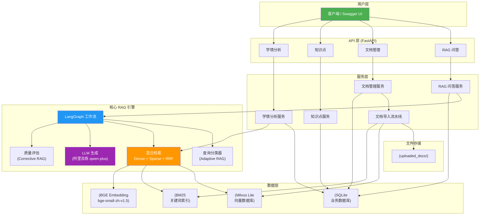
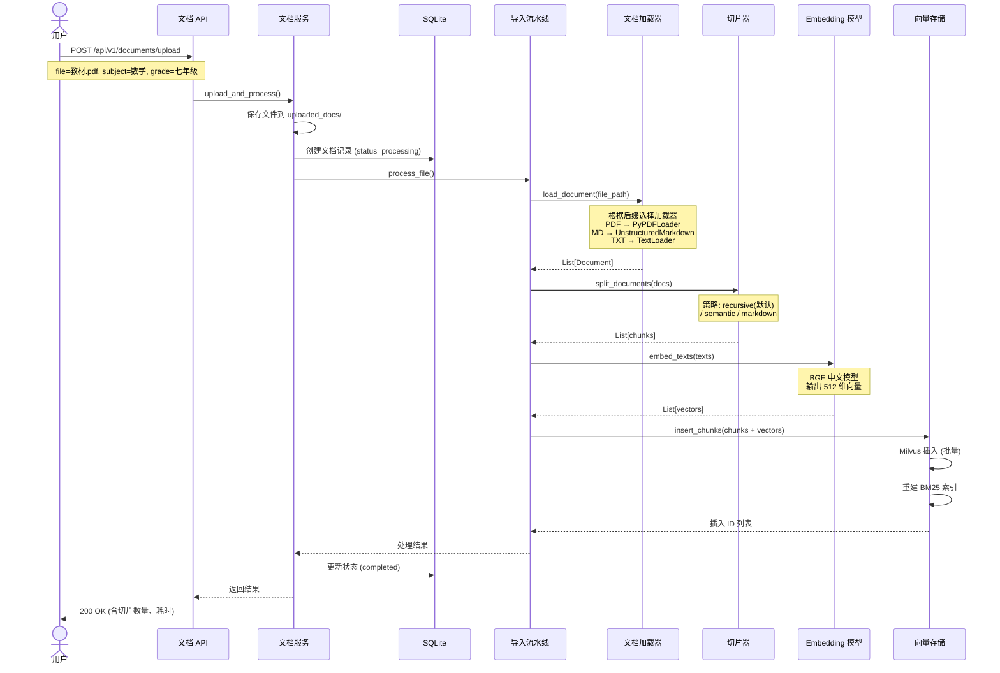
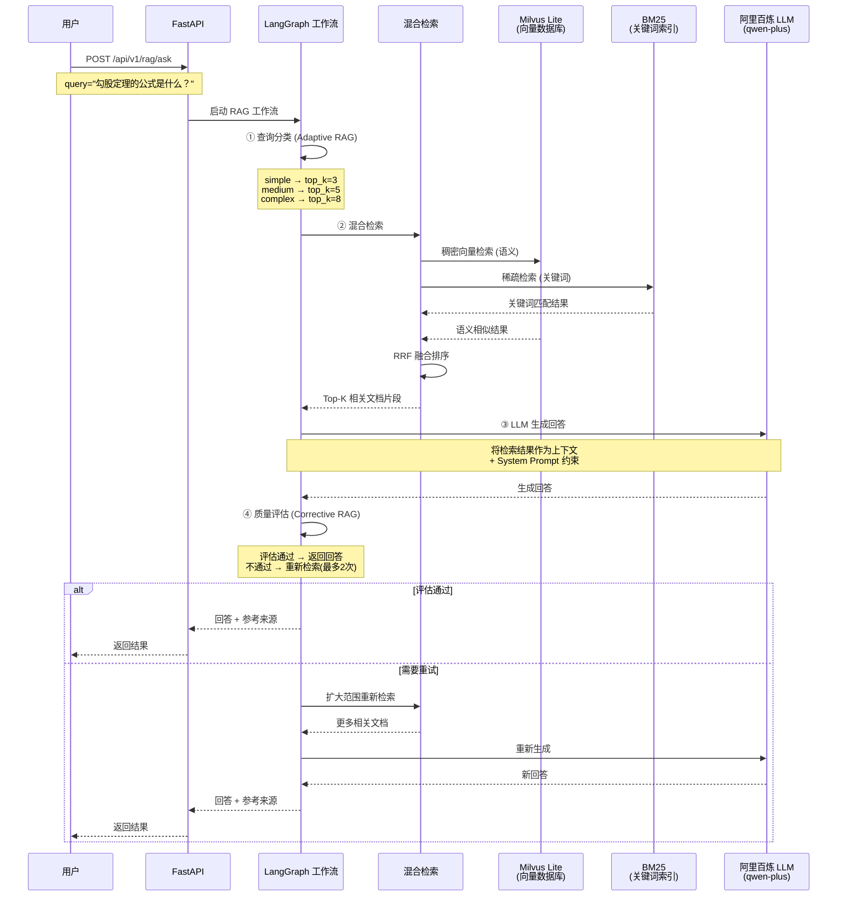

# K12 教育 RAG 系统

基于 **LangGraph + Milvus Lite + BGE Embedding + 阿里百炼 LLM** 的 K12 教育知识库智能问答系统。

---

## 目录

- [项目概述](#项目概述)
- [技术栈](#技术栈)
- [本地启动](#本地启动)
- [项目结构](#项目结构)
- [核心原理](#核心原理)
- [面试常见问题](#面试常见问题)

---

## 项目概述

### 解决什么问题

K12 教育场景中，学生和教师面对大量教材、教辅、试题文档，传统搜索（Elasticsearch、数据库 LIKE 查询）无法理解语义。比如搜"勾股定理的公式是什么"，如果文档里写的是"直角三角形两直角边的平方和等于斜边的平方"，传统搜索就匹配不到。

RAG（Retrieval-Augmented Generation，检索增强生成）的方案是：先把教材文档向量化存到向量数据库，用户提问时，把问题也转成向量，去向量库找最相似的片段，然后把这些片段作为上下文交给大模型，让大模型基于这些材料回答。这样既利用了 LLM 的理解和生成能力，又保证了回答内容来自私有教材，不会胡编乱造。

### 技术亮点

| 特性 | 说明 |
|------|------|
| **混合检索** | 稠密向量（语义）+ 稀疏向量（关键词）双路检索，RRF 算法融合结果 |
| **Adaptive RAG** | 根据问题复杂度动态调整检索策略，简单问题快，复杂问题深 |
| **Corrective RAG** | 自动评估生成质量，不合格则重新检索再生成，最多重试 2 次 |
| **LangGraph 编排** | 用有向图定义 RAG 流程，每个环节是独立节点，便于扩展 |
| **Milvus Lite** | 向量数据库的轻量版，单文件存储，无需部署服务器 |

---

## 系统架构



### 文档导入流程



---

## 技术栈

| 组件 | 选型 | 说明 |
|------|------|------|
| **编程语言** | Python 3.13 | 异步支持好，AI 生态最丰富 |
| **Web 框架** | FastAPI | 高性能异步框架，自带 Swagger 文档 |
| **流程编排** | LangGraph | 用图结构编排 RAG 多步骤流程 |
| **向量数据库** | Milvus Lite | 轻量级向量数据库，单文件存储 |
| **Embedding 模型** | BAAI/bge-small-zh-v1.5 | 中文语义向量模型，512 维 |
| **LLM** | 阿里百炼 qwen-plus | 兼容 OpenAI API，国内访问稳定 |
| **文档解析** | Unstructured + PyPDF | PDF/MD/TXT 解析 |
| **文本切分** | LangChain Text Splitters | 递归/语义/Markdown 多种切分策略 |
| **BM25 检索** | rank_bm25 | 本地关键词检索，与向量检索互补 |
| **数据库** | SQLite + SQLAlchemy | 存储业务数据（文档记录、问答历史等） |

### 关键依赖包详解

面试中可能会被问到"为什么选这个包"，下面是核心依赖的作用：

**pymilvus（含 milvus-lite）**
向量数据库的 Python SDK。Milvus Lite 是其轻量模式，数据存在本地文件（如 `milvus_k12.db`），无需安装 Docker 或单独的数据库服务。支持 FLAT、IVF_FLAT 等索引类型，支持余弦相似度等向量检索。

**langchain / langchain-core / langchain-community**
LangChain 生态的核心包。提供 Document 数据结构、Embedding 封装、文本切分器等基础能力。本项目的 Embedding 调用和文档处理依赖它。

**langchain-milvus**
LangChain 和 Milvus 的桥梁。不过本项目为了精细控制（混合检索 + RRF 融合），直接使用 pymilvus 的底层 API，没有用这个包的封装。

**sentence-transformers**
加载 BGE 等预训练 Embedding 模型的引擎。将文本转换成固定维度的向量，用于语义检索。

**rank_bm25**
BM25 算法的 Python 实现。BM25 是经典的关键词检索算法，是 TF-IDF 的改进版。在本项目中与稠密向量检索互补（稠密找语义相似的，BM25 找关键词匹配的），然后通过 RRF 算法融合结果。

**unstructured**
文档解析库，支持 PDF（含 OCR）、Word、Markdown 等多种格式。比 PyPDF 更强大，能识别文档结构（标题、段落、表格）。

**httpx**
异步 HTTP 客户端。用来调用 LLM API（阿里百炼的 /chat/completions 接口）。

---

## 本地启动

### 前置条件

- Python 3.11+
- 阿里百炼 API Key（在 https://bailian.console.aliyun.com 获取）

### 启动步骤

```bash
# 1. 克隆项目
cd rag2

# 2. 创建虚拟环境
python -m venv .venv

# 3. 激活虚拟环境
# macOS/Linux:
source .venv/bin/activate
# Windows:
# .venv\Scripts\activate

# 4. 安装依赖
pip install -r requirements.txt

# 5. 配置环境变量（编辑 .env 文件）
#    主要把 LLM_API_KEY 改成你在阿里百炼的 key
#    .env 文件内容如下：
#    LLM_API_KEY=sk-你的百炼key
#    LLM_BASE_URL=https://dashscope.aliyuncs.com/compatible-mode/v1
#    LLM_MODEL=qwen-plus
#    MILVUS_URI=./milvus_k12.db
#    EMBEDDING_MODEL=BAAI/bge-small-zh-v1.5
#    EMBEDDING_DEVICE=cpu
#    HF_ENDPOINT=https://hf-mirror.com
#    APP_HOST=0.0.0.0
#    APP_PORT=8000
#    LOG_LEVEL=INFO

# 6. 国内网络需要设置 HuggingFace 镜像（用于下载 Embedding 模型）
export HF_ENDPOINT=https://hf-mirror.com

# 7. 启动服务
python main.py

# 8. 打开浏览器访问
#    API 文档: http://localhost:8000/docs
#    健康检查: http://localhost:8000/health
```

### 验证服务是否正常

```bash
# 健康检查
curl http://localhost:8000/health

# 上传文档
curl -X POST http://localhost:8000/api/v1/documents/upload \
  -F "file=@教材.md" \
  -F "subject=数学" \
  -F "grade=七年级"

# 提问
curl -X POST http://localhost:8000/api/v1/rag/ask \
  -H "Content-Type: application/json" \
  -d '{"query": "一元一次方程怎么解？", "subject": "数学", "grade": "七年级"}'
```

---

## 项目结构

```
rag2/
├── main.py                         # FastAPI 应用入口，启动服务器
├── config.py                       # 全局配置，从环境变量读取
├── requirements.txt                # Python 依赖清单
├── .env                            # 环境变量配置（API Key 等）
├── .env.example                    # 环境变量模板
│
├── core/                           # 核心 RAG 引擎
│   ├── __init__.py
│   ├── embeddings.py               # Embedding 模型封装
│   ├── vectorestore.py             # 向量存储（Milvus Lite + BM25 + RRF）
│   ├── graph.py                    # LangGraph 工作流定义
│   └── nodes/                      # 工作流节点
│       ├── __init__.py
│       ├── query_classifier.py     # 查询分类（Adaptive RAG）
│       ├── retriever.py            # 混合检索
│       ├── generator.py            # LLM 生成
│       └── evaluator.py            # 质量评估（Corrective RAG）
│
├── ingestion/                      # 文档导入流水线
│   ├── __init__.py
│   ├── loader.py                   # 文档加载器
│   ├── chunker.py                  # 文本切片器
│   └── pipeline.py                 # 入库流水线
│
├── models/                         # 数据模型
│   ├── __init__.py
│   ├── schemas.py                  # Pydantic API 请求/响应模型
│   └── db_models.py                # SQLAlchemy ORM 模型
│
├── services/                       # 业务服务层
│   ├── __init__.py
│   ├── rag_service.py              # RAG 问答服务
│   ├── document_service.py         # 文档管理服务
│   ├── knowledge_service.py        # 知识点服务
│   └── analytics_service.py        # 学情分析服务
│
├── api/                            # API 接口层
│   ├── __init__.py
│   ├── rag.py                      # 问答接口
│   ├── documents.py                # 文档管理接口
│   ├── knowledge.py                # 知识点接口
│   └── analytics.py                # 学情分析接口
│
├── utils/                          # 工具
│   ├── __init__.py
│   └── logger.py                   # 日志工具
│
└── tests/                          # 测试
    ├── __init__.py
    └── test_rag.py                 # 集成测试
```

---

## 核心原理

### 1. 什么是 RAG



RAG 对比纯 LLM 的优势：
- **知识可控**：回答基于私有知识库，不是 LLM 训练数据里的内容
- **减少幻觉**：LLM 看到相关原文再回答，瞎编的概率大幅降低
- **知识更新快**：替换知识库文档即可，不用重新训练模型

### 2. 混合检索为什么好

单一检索方式有各自的缺陷：

| 检索方式 | 优点 | 缺点 |
|----------|------|------|
| 稠密向量（语义） | 理解语义，同义查询也能命中 | 对精确关键词不敏感 |
| BM25（关键词） | 精确匹配关键词 | 不理解语义，"方程"和"等式"无法关联 |

混合检索 = 两种都查 + RRF 融合结果，取长补短。

### 3. RRF 融合算法

RRF（Reciprocal Rank Fusion）的公式：

```
score(d) = Σ 1 / (k + rank_i(d))
```

其中 `rank_i(d)` 是文档 d 在第 i 路检索中的排名，k 是平滑参数（通常 60）。简单说：如果一篇文档在两路检索中排名都靠前，它的融合得分就会很高；如果只在某一路排名高，得分也不会太低。这样兼顾了两种检索方式的优势。

### 4. LangGraph 工作流


---

## 面试常见问题

### Q1: 为什么用 Milvus Lite 而不是 Milvus Standalone/Distributed？

答：Milvus Lite 是 Milvus 的轻量版，数据存在本地文件 `milvus_k12.db` 里，不需要安装 Docker 或者配置分布式集群。对于 K12 项目这种数据量不大（几万到几十万条）、并发不高的场景完全够用。上线后如果想扩展，代码完全不用改，只需要把 `MILVUS_URI` 从本地文件路径改成 Milvus Standalone 的服务地址就行，API 是兼容的。

### Q2: BM25 和向量检索的区别是什么？

答：BM25 是关键词匹配，统计查询词在文档中出现的频率和稀有程度来打分，优点是精确匹配关键词，缺点是"方程"和"等式"这种语义相近的词它认为不相关。向量检索是把文本转成向量，用余弦相似度衡量语义相似度，优点是能理解语义，缺点是可能忽略精确的关键词匹配。混合检索就是两种都用，然后用 RRF 算法把结果融合起来。

### Q3: Corrective RAG 是怎么实现的？

答：核心就是"生成 → 评估 → 纠正"的闭环。LLM 生成回答后，我们检查三个维度：检索结果的相关性得分够不够高、回答是否为空或过短、如果有重试机会是否要再试一次。如果检测到问题（比如检索得分低、回答太短），就重新检索（这次扩大检索范围）再生成一次。最多重试 2 次，如果还不行就返回"未找到相关信息"的兜底回复。

### Q4: Embedding 模型为什么选 BGE 而不是 OpenAI 的？

答：BGE（BAAI 智源研究院出品）是中文场景下最好的开源 Embedding 模型之一，bge-small-zh 只有 512 维但效果接近 large 版本，速度快很多。用开源模型的好处是：不需要调用外部 API（省钱、低延迟、不依赖网络）、数据不出本机（安全性）、可以离线部署。

---

## API 接口一览

启动后访问 `http://localhost:8000/docs` 可查看 Swagger 文档。

| 方法 | 路径 | 说明 |
|------|------|------|
| GET | `/` | 系统信息 |
| GET | `/health` | 健康检查 |
| POST | `/api/v1/rag/ask` | 问答请求 |
| POST | `/api/v1/rag/feedback` | 提交问答反馈 |
| POST | `/api/v1/documents/upload` | 上传文档 |
| GET | `/api/v1/documents/list` | 文档列表 |
| DELETE | `/api/v1/documents/{id}` | 删除文档 |
| GET | `/api/v1/knowledge-points/tree` | 知识点树 |
| POST | `/api/v1/knowledge-points/` | 创建知识点 |
| GET | `/api/v1/analytics/weak-points/{user_id}` | 薄弱知识点 |
| GET | `/api/v1/analytics/history/{user_id}` | 问答历史 |
| GET | `/api/v1/analytics/recommend/{user_id}` | 复习推荐 |

---

## LangGraph 工作流图

```
                    ┌──────────┐
                    │ classify  │  ← Adaptive RAG: 判断查询复杂度
                    └────┬─────┘
                         │
                         ▼
                    ┌──────────┐
                    │ retrieve  │  ← Dense + Sparse + RRF 混合检索
                    └────┬─────┘
                         │
                         ▼
                    ┌──────────┐
                    │ generate  │  ← LLM (阿里百炼 qwen-plus)
                    └────┬─────┘
                         │
                         ▼
                    ┌──────────┐
                    │ evaluate  │  ← Corrective RAG: 质量评估
                    └────┬─────┘
                         │
              ┌──────────┴──────────┐
              │                     │
          accept                 retry
              │                     │
              ▼                     ▼
           返回回答           ┌────────────┐
                            │ re_retrieve │  ← 扩大检索范围
                            └──────┬─────┘
                                   │
                                   ▼
                              ┌──────────┐
                              │ generate  │  ← 重新生成
                              └──────────┘
```
