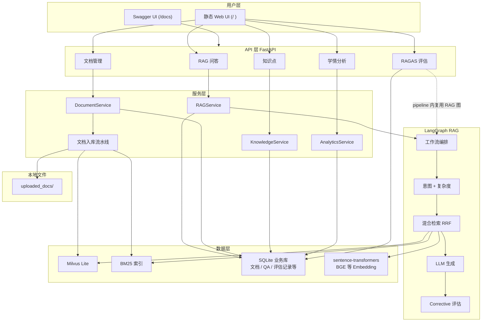

# K12 教育领域 RAG 知识库问答系统

面向 K12 教学内容的检索增强生成（RAG）服务：基于 **LangGraph** 编排问答流程，**Milvus Lite** 承载向量检索，**sentence-transformers / BGE** 提供 Embedding，LLM 通过 **OpenAI 兼容 HTTP API** 接入（默认 **阿里百炼** `qwen-plus`）。系统提供 **REST API**、**静态 Web 控制台**、**学情分析**，并集成 **RAGAS** 用于离线质量评估。**应用版本**：当前发布标识为 `1.0.0`（见 `main.py` 元数据）。

---

## 目录

- [概述](#概述)
- [系统架构](#系统架构)
- [技术栈](#技术栈)
- [部署与本地运行](#部署与本地运行)
- [Web 控制台与 API](#web-控制台与-api)
- [RAGAS 评估](#ragas-评估)
- [数据持久化与本地资源](#数据持久化与本地资源)
- [测试集 manual_v1.jsonl](#manual_v1jsonl)
- [配置参考](#配置参考)
- [仓库结构](#仓库结构)
- [检索与流水线说明](#检索与流水线说明)
- [安全与合规](#安全与合规)
- [已知限制与排查](#已知限制与排查)

---

## 概述

### 背景与目标

教材与教辅以自然语言为主，字面匹配检索难以覆盖同义表述与释义性描述。系统将文档切分为片段、完成向量化并入库存储；用户提问时通过 **稠密 + 稀疏混合检索** 召回相关片段，再由 LLM 在约束下生成答复，从而在私有语料范围内提升可解释性与可控性。

### 主要能力

| 特性 | 说明 |
|------|------|
| **混合检索** | 稠密向量（语义）+ BM25（关键词），RRF 融合 |
| **意图与复杂度** | 教育 / 闲聊分流；教学问句再分 simple / medium / complex 调节检索深度 |
| **Corrective RAG** | 生成后质量评估，不通过则扩检索并重试（可配置上限） |
| **LangGraph 编排** | 分类 → 检索 → 生成 → 评估 → （重试）流程图式定义 |
| **Milvus Lite** | 本地单文件向量库（`pymilvus` + lite），免去单独部署向量服务 |
| **RAGAS 评估** | Faithfulness、Answer Relevancy 等指标；评估结果写入业务库并在控制台展示历史 |
| **Web 控制台** | `static/index.html`：问答、文档导入、学情、知识点维护、评估任务 |

### 应用场景与边界

**适用场景**

- 校本/机构内部 **教材与教辅** 的语义检索与自然语言问答，支持按 **学科、年级** 过滤召回范围。  
- **教学运营**：文档批量入库、切片策略可配，便于迭代知识库。  
- **质量度量**：通过 RAGAS 对回答进行多指标打分，并保留历史记录便于对比不同模型或语料版本。  
- **学情链路**：在持续产生 `user_id` 与问答历史的前提下，使用分析类接口观察薄弱点与推荐路径（具体统计逻辑以 `services/analytics_service.py` 为准）。

**使用边界（非目标）**

- 不提供多租户隔离、细粒度权限模型与审计全流程，生产环境需在上层网关或业务系统中补齐 **认证授权**与 **访问控制**。  
- Milvus **Lite** 面向单机与中小规模数据集；超高并发或多副本部署应考虑 **Milvus 集群形态**并做好客户端与运维配套。  
- 闲聊分支仅用于非教学类短对话分流，不适合作为通用开放域客服机器人基座。

---

## 系统架构



### 文档入库（概要）

在 **系统架构** 图中，导入流水线由文档服务触发；数据流为：上传 PDF / Markdown / TXT → 解析与切片 → Embedding → Milvus 写入并同步稀疏索引（BM25）→ SQLite 更新文档状态。HTTP 入口：`POST /api/v1/documents/upload`。

---

## 技术栈

| 组件 | 选型 | 说明 |
|------|------|------|
| 语言运行时 | Python 3.11+ | 建议在 3.11～3.13 |
| Web | FastAPI + Uvicorn | 异步 API，自带 OpenAPI |
| 编排 | LangGraph | RAG 状态机与工作流 |
| 向量库 | Milvus Lite（pymilvus） | 配置项见 `K12_MILVUS_URI` |
| Embedding | sentence-transformers | 默认 `BAAI/bge-small-zh-v1.5` |
| LLM | OpenAI SDK 兼容端点 | 默认百炼 Compatible Mode，`LLM_BASE_URL` + `LLM_MODEL` |
| 文档 | unstructured、pypdf | PDF / MD / TXT |
| 稀疏检索 | rank_bm25 | 与稠密向量互补 |
| 业务库 | SQLite + SQLAlchemy async | `k12_business.db` |
| 离线评估 | RAGAS + datasets | Instructor 结构化输出，`RAGAS_LLM_MAX_TOKENS` 可调 |

### 核心第三方组件

- **pymilvus**：向量检索客户端；Milvus Lite 模式下 URI 指向本地持久化文件。  
- **LangChain**：部分抽象与惯例；向量存储本项目以 **`K12VectorStore`**（`core/vectorestore.py`）为主。  
- **sentence-transformers**：加载 Embedding 编码器（如 BGE 系列）。  
- **rank_bm25**：稀疏检索打分。  
- **RAGAS / Hugging Face datasets**：离线评估流水线与数据集表示。

### 声明式依赖版本

以下与 [`requirements.txt`](requirements.txt) 一致，仅供快速浏览；安装与冲突解决请以该文件为准。

| 类别 | 包名（节选） | 说明 |
|------|----------------|------|
| 向量与检索 | `pymilvus>=2.4.2` | Milvus 客户端（含 Lite 场景） |
| 应用框架 | `fastapi>=0.110.0`、`uvicorn[standard]>=0.27.0` | HTTP 服务 |
| LangGraph / LangChain | `langchain>=1.2.0`、`langchain-core`、`langchain-community`、`langchain-milvus`、`langchain-openai` | 编排与生态组件 |
| 向量化 | `sentence-transformers>=3.0.0` | Embedding 推理 |
| 文档 | `unstructured[pdf,md]`、`pypdf` | 解析与切分流水线 |
| 评估 | `ragas>=0.2.0`、`datasets>=3.0.0` | RAGAS 与数据集 |
| 持久化 | `sqlalchemy>=2.0.0`、`aiosqlite`、`greenlet` | 异步 SQLite |
| 其它 | `rank_bm25`、`httpx`、`python-dotenv`、`python-multipart` | BM25、HTTP 客户端、环境与上传 |

---

## 部署与本地运行

### 环境与依赖

- **Python**：3.11 及以上（推荐 3.11～3.13）。
- **Embedding**：需能访问模型权重（公网、[Hugging Face 镜像](https://hf-mirror.com)或本地缓存目录）。
- **LLM**：使用百炼或其它 OpenAI 兼容服务时配置 `LLM_API_KEY`、`LLM_BASE_URL`、`LLM_MODEL`。

### 安装与启动

```bash
git clone <repository-url>
cd edu-rag

python -m venv .venv
source .venv/bin/activate    # Windows: .venv\Scripts\activate

pip install -r requirements.txt
cp .env.example .env         # 按环境修改变量
```

**环境变量摘要**（完整说明见 [.env.example](.env.example)）：

| 变量 | 说明 |
|------|------|
| `LLM_API_KEY` / `LLM_BASE_URL` / `LLM_MODEL` | 大模型网关；默认值指向阿里百炼兼容接口 |
| `K12_MILVUS_URI` | Milvus Lite 数据库文件路径，勿与系统环境变量 **`MILVUS_URI`** 同名冲突 |
| `EMBEDDING_MODEL` / `EMBEDDING_DEVICE` | 向量模型名与运行设备 |
| `HF_ENDPOINT` | 国内下载模型常用镜像，如 `https://hf-mirror.com` |
| `RAGAS_LLM_MAX_TOKENS` | RAGAS 结构化输出单次生成上限（默认 8192，避免 Faithfulness 等 JSON 截断） |
| `DENSE_MIN_SIMILARITY` | 可选：稠密检索余弦下限过滤 |

可选：在当前 shell 设置 Hugging Face 端点后启动应用：

```bash
export HF_ENDPOINT=https://hf-mirror.com
python main.py
```

- **控制台**：`http://localhost:8000/`
- **OpenAPI**：`http://localhost:8000/docs`
- **健康检查**：`GET /health`

**连通性自检示例**：

```bash
curl -s http://localhost:8000/health

curl -X POST http://localhost:8000/api/v1/rag/ask \
  -H "Content-Type: application/json" \
  -d '{"query": "一元一次方程怎么解？", "subject": "数学", "grade": "七年级", "user_id": "demo"}'
```

### 开发模式（热重载）

```bash
uvicorn main:app --reload --host 0.0.0.0 --port 8000
```

> **说明**：Milvus Lite 须在 **异步事件循环启动前** 完成初始化；`python main.py` 已按该顺序封装。若自行用 Uvicorn 多 worker 拉起进程，请先确认是否与 Milvus Lite 进程的 **单实例约束**相符。

---

## Web 控制台与 API

前端为单页应用，侧边栏功能模块如下：

| 模块 | 功能 |
|------|------|
| RAG 问答 | 多学科/年级筛选、引用来源面板 |
| 文档管理 | 上传、列表、删除、切片策略 |
| 学情分析 | 与用户 ID 关联的统计分析（依赖历史数据） |
| 知识点 | 维护知识点树 |
| 效果评估 | JSON/JSONL 测试集上传 → RAG 生成答案 → RAGAS 打分；结果持久化并可查看历史记录 |

### 主要 HTTP 路由

以下为基础清单，**字段与错误码以运行实例中的 `/docs` 为准**。

| 方法 | 路径 | 说明 |
|------|------|------|
| GET | `/` | 返回 Web UI（`static/index.html`） |
| GET | `/health` | 健康检查 |
| POST | `/api/v1/rag/ask` | 问答 |
| POST | `/api/v1/rag/feedback` | 对某条 QA 点赞/差评 |
| POST | `/api/v1/documents/upload` | 上传文档并入库 |
| GET | `/api/v1/documents/list` | 文档列表 |
| DELETE | `/api/v1/documents/{id}` | 删除文档 |
| GET | `/api/v1/knowledge-points/tree` | 知识点树 |
| POST | `/api/v1/knowledge-points/` | 创建知识点 |
| GET | `/api/v1/analytics/weak-points/{user_id}` | 薄弱知识点等 |
| GET | `/api/v1/analytics/history/{user_id}` | 问答历史 |
| GET | `/api/v1/analytics/recommend/{user_id}` | 复习推荐 |
| POST | `/api/v1/evaluation/from-content` | 表单：`content`/`file` + `metrics`，实时 RAG + RAGAS |
| POST | `/api/v1/evaluation/from-history` | 按 QA 历史批量评估 |
| GET | `/api/v1/evaluation/history` | 评估记录列表 |
| GET | `/api/v1/evaluation/history/{id}` | 单条评估明细（含各题得分） |

---

## RAGAS 评估

- **指标**：与支持 RAGAS 当前版本的传统指标标识一致（如 `faithfulness`、`answer_relevancy`、`context_precision`；启用 `context_recall` 时建议在数据集中提供 `ground_truth`）。  
- **持久化**：评估完成后写入 SQLite 表 `evaluation_records`；控制台支持列表与明细查询；REST 响应在入库成功时可包含 `record_id`。  
- **命令行**：见 [`evaluation/cli.py`](evaluation/cli.py)：`evaluate`（`--from-db`、`--from-file`、`--live` 等）、`generate`、`validate`、`export` 等子命令。  
- **运行参数**：Faithfulness / Context 等依赖 Instructor 结构化输出，若单次生成长度过长导致截断，应提高环境变量 **`RAGAS_LLM_MAX_TOKENS`**；若检索上下文为空，上下文相关指标可能无效或分值异常，请核对知识库数据与检索过滤条件。

---

## 数据持久化与本地资源

| 路径 / 标识 | 内容 |
|-------------|------|
| `k12_business.db`（默认） | SQLite：文档元数据、问答记录、知识点、`evaluation_records` 等业务表 |
| `K12_MILVUS_URI` 指向的文件 | Milvus Lite 向量与索引数据 |
| `uploaded_docs/` | 用户上传文档的落盘副本（文件名通常带 UUID 前缀） |
| HuggingFace 缓存目录 | Embedding 权重缓存在本机用户目录下（取决于 `sentence-transformers` / `HF_HOME` 等环境） |
| 日志 | `k12_rag` 等 logger，默认级别见 `LOG_LEVEL` |

清空或迁移环境时：**先停服务**，再按需备份上述数据库文件与向量库文件；替换 Embedding 维度或集合结构后通常需 **重新入库**。

**随附示例资源**（便于联调与演示；不保证与生产语料一致）：

| 路径 | 说明 |
|------|------|
| [`sample_docs/`](sample_docs/) | 语文/数学等小样本教材片段，可配合「文档上传」走通入库与问答 |
| [`evaluation/sample_test.json`](evaluation/sample_test.json) | 含 `question` / `contexts` / `ground_truth` 的 JSON 示例，适合理解 RAGAS 输入形态 |
| [`data/test_sets/manual_v1.jsonl`](data/test_sets/manual_v1.jsonl) | 手工编写的多科问答测试集，见下节说明 |

### manual_v1.jsonl

文件路径：**[`data/test_sets/manual_v1.jsonl`](data/test_sets/manual_v1.jsonl)**。

**定位**：面向 RAG 联调与 RAGAS 回归的 **小规模人工基准集**（当前 **12** 条），覆盖数学、生物、物理，年级以初中、高中为主；题型包含定义、应用、对比与开放问答等，并标注了预期 **查询复杂度**（与系统内 `simple` / `medium` / `complex` 概念对齐，便于观察检索深度差异）。

**格式**：JSONL，**每行一个 JSON 对象**，字段如下。

| 字段 | 类型 | 说明 |
|------|------|------|
| `question` | string | 用户问题（必填；实时评估时由 RAG 生成 `answer` 与 `contexts`） |
| `ground_truth` | string | 参考答案（用于 `context_recall` 等需标准答案的指标） |
| `complexity` | string | 标注难度：`simple` / `medium` / `complex`（元数据，当前流水线以分类器结果为准，可用于筛题或扩展脚本） |
| `question_type` | string | 题型标签，如「定义题」「应用题」「对比题」「开放题」 |
| `subject` | string | 学科，如「数学」「生物」「物理」 |
| `grade` | string | 学段标签，如「初中」「高中」 |

**使用方式**：

- **Web 控制台**：在「效果评估」中粘贴该文件全文或上传文件；可选学科/年级与 RAGAS 指标。系统会按行调用 RAG，再对生成结果打分；含 `ground_truth` 时可勾选 **`context_recall`**。  
- **命令行**：例如 `python evaluation/cli.py evaluate --from-file data/test_sets/manual_v1.jsonl --live --metrics faithfulness,answer_relevancy`（`--live` 需已初始化向量库，参见 `evaluation/cli.py`）。

**注意**：评分质量强依赖知识库中是否已有与题目相关的入库文档；若检索为空，上下文类指标会失真。扩展该文件时请保持 **一行一 JSON**、键名与上表一致。

---

## 配置参考

除 `.env` / `.env.example` 所载变量外，下列参数在 **`config.py`** 中维护，可按需调整并重新部署：

| 参数 | 默认 / 含义 | 作用简述 |
|------|-------------|-----------|
| `TOP_K` | 5 | 单次检索返回的片段数量基数（复杂度会在节点内进一步调节） |
| `CHUNK_SIZE` / `CHUNK_OVERLAP` | 512 / 64 | 文档切片字符规模与重叠 |
| `RRF_K` | 60 | Reciprocal Rank Fusion 平滑常数 \(k\) |
| `DENSE_WEIGHT` / `SPARSE_WEIGHT` | 0.7 / 0.3 | 定义于配置中；**混合检索主线**使用 RRF 融合（见 `core/vectorestore.py`），这两项现主要用于 **评估结果中的配置快照**（`evaluation/pipeline.py`），便于回溯实验环境 |
| `DENSE_MIN_SIMILARITY` | 0（可由环境变量设置） | 稠密检索余弦相似度下限，低于则丢弃 |
| `MAX_RETRIES` | 2 | Corrective RAG 最大重试轮次 |
| `CONFIDENCE_THRESHOLD` / `BERT_MAX_LENGTH` | 0.7 / 128 | 意图链路中本地分类器阈值与序列长度 |
| `LLM_TIMEOUT_SECONDS` / `ENABLE_LLM_FALLBACK` | 3 / True | LLM 参与意图兜底时的超时与开关 |

---

## 仓库结构

```
edu-rag/
├── main.py                     # FastAPI 入口（含 Milvus 同步初始化）
├── config.py                   # 全局配置
├── requirements.txt
├── .env.example
├── sample_docs/                # 入门用小型教材样例（TXT/MD）
├── data/                       # 可选：测试集、意图训练样本等（按需使用）
├── static/
│   └── index.html              # Web 控制台
├── core/
│   ├── embeddings.py
│   ├── vectorestore.py         # Milvus + BM25 + RRF
│   ├── graph.py                # LangGraph 编排
│   └── nodes/
│       ├── query_classifier.py # 复杂度 + 异步意图分流
│       ├── bert_classifier.py / llm_classifier.py / keyword_matcher.py …
│       ├── chitchat.py
│       ├── retriever.py
│       ├── generator.py
│       └── evaluator.py        # Corrective RAG 规则评估
├── ingestion/
│   ├── loader.py / chunker.py / pipeline.py
├── evaluation/
│   ├── ragas_evaluator.py      # LLM / Embedding / 指标适配
│   ├── pipeline.py             # run_evaluation / run_live_evaluation / 入库
│   ├── dataset_builder.py
│   ├── schemas.py
│   ├── testset_generator.py
│   ├── sample_test.json       # 离线评估示例数据
│   └── cli.py
├── api/
│   ├── rag.py / documents.py / knowledge.py / analytics.py / evaluation.py
├── services/
├── models/
└── utils/
```

---

## 检索与流水线说明

### 问答主链路

1. **意图与复杂度**：非教育类查询进入闲聊分支；教育类查询通过规则或模型划分为 `simple` / `medium` / `complex`，影响检索广度等参数（见 `core/nodes/query_classifier.py` 等）。
2. **混合检索**：同一查询在稠密向量（Milvus）与 BM25 上并行检索，使用 RRF（Reciprocal Rank Fusion）合并排序结果。
3. **生成**：将召回片段与用户问题、会话历史送至 LLM 生成答复（支持流式输出由服务层接管）。
4. **纠正（Corrective RAG）**：`evaluator` 节点依据检索相关性、答复长度等规则给出 `accept` / `retry` / `give_up`；为 `retry` 时触发 `re_retrieve`（扩大检索）并再次生成，重试上限由配置约束（参见 `core/graph.py`、`config.MAX_RETRIES`）。

### RRF 融合公式

对文档 \(d\) 在多路检索中的名次 \(rank_i(d)\)，采用：

\[
\mathrm{score}(d) = \sum_i \frac{1}{k + rank_i(d)}
\]

本项目默认 \(k=\) **`RRF_K`**（通常为 60，见 `config.py`）。

### LangGraph 节点拓扑（概要）

常规教育问答路径：`classify` → `retrieve` → `generate` → `evaluate` →（`accept`）`finalize` 结束；若为 `retry` 则 `re_retrieve` → `generate` → … 直至 `accept` 或达到重试上限后 `finalize`。非教育意图经 `classify` → `chitchat` → `finalize`，不执行向量检索。

实现细节与条件边定义见 **`core/graph.py`**。行为变更以源代码及 **`GET /docs`** 为准。

---

## 安全与合规

- **密钥管理**：`LLM_API_KEY` 及其它敏感信息仅通过环境变量或私有配置注入，**不要将 `.env` 提交至版本库**（仓库已提供 `.env.example`）。
- **CORS**：默认 `allow_origins=["*"]`，面向公网部署时应在 `main.py` 中收紧为明确来源列表。
- **数据留存**：问答与评估记录落库于 SQLite，请按组织策略做 **保留周期、备份与脱敏**。
- **内容责任**：生成内容来自「检索上下文 + LLM」，教学场景下仍建议人工抽检与引用核对。

---

## 已知限制与排查

| 现象 | 可能原因 | 建议 |
|------|-----------|------|
| `/health` 中 `vector_store` 异常 | Milvus Lite 未就绪或锁文件占用 | 确认单进程初始化；检查 `.milvus*.db.lock` 等是否在异常退出后残留 |
| `too_many_pings` / gRPC 告警 | Milvus Lite 与客户端 HTTP/2 保活在高频请求下偶发 | 一般为瞬态；持续出现时降低并发或升级 `pymilvus` |
| 检索结果为空、上下文类指标偏低 | 知识库为空、筛选过严或向量未入库 | 检查文档状态、`subject`/`grade`、`DENSE_MIN_SIMILARITY` |
| Faithfulness 等结构化指标失败 | Instructor 输出被 `max_tokens` 截断 | 提高 **`RAGAS_LLM_MAX_TOKENS`** |
| 控制台与纯 API 表现不一致 | 流式输出经服务层队列推送 | 对照 `services/rag_service.py` 与 `core/stream_queue.py` |
