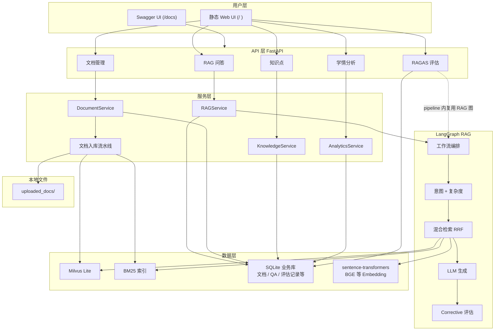

# K12 教育 RAG 系统

基于 **LangGraph + Milvus Lite + BGE Embedding + OpenAI 兼容 LLM（默认阿里百炼 qwen-plus）** 的 K12 知识库问答系统，附带 **静态管理后台**、**学情分析**与 **RAGAS 质量评估**。

---

## 目录

- [项目概述](#项目概述)
- [系统架构](#系统架构)
- [技术栈](#技术栈)
- [本地启动](#本地启动)
- [Web 界面与 API](#web-界面与-api)
- [RAGAS 评估](#ragas-评估)
- [项目结构](#项目结构)
- [核心原理](#核心原理)
- [面试常见问题](#面试常见问题)

---

## 项目概述

### 解决什么问题

K12 场景下教材、教辅体量大，传统关键词搜索难以理解语义（例如「勾股定理公式」需要匹配「直角三角形两直角边的平方和……」）。本系统采用 **RAG**：文档切片后 Embedding 存入向量库；用户提问时混合检索相关片段，再交给 LLM **基于检索内容**生成回答，便于溯源、减轻胡编。

### 技术亮点

| 特性 | 说明 |
|------|------|
| **混合检索** | 稠密向量（语义）+ BM25（关键词），RRF 融合 |
| **意图与复杂度** | 教育 / 闲聊分流；教学问句再分 simple / medium / complex 调节检索深度 |
| **Corrective RAG** | 生成后质量评估，不通过则扩检索并重试（可配置上限） |
| **LangGraph 编排** | 分类 → 检索 → 生成 → 评估 → （重试）流程图式定义 |
| **Milvus Lite** | 本地单文件向量库（`pymilvus` + lite），免去单独部署向量服务 |
| **RAGAS 评估** | Faithfulness / Answer Relevancy 等指标；结果入库 + 控制台历史查看 |
| **管理后台** | `static/index.html`：问答、文档、学情、知识点、评估一体化入口 |

---

## 系统架构



### 文档导入流程（简要）

上传 PDF / Markdown / TXT → 解析与切分 → Embedding → 写入 Milvus + 重建 BM25 → SQLite 更新文档状态。详细时序可参考旧版 README 中的序列图思路，接口为 `POST /api/v1/documents/upload`。

---

## 技术栈

| 组件 | 选型 | 说明 |
|------|------|------|
| 语言运行时 | Python 3.11+ | 推荐使用 3.11～3.13 |
| Web | FastAPI + Uvicorn | 异步 API，自带 OpenAPI |
| 编排 | LangGraph | RAG 状态机与工作流 |
| 向量库 | Milvus Lite（pymilvus） | 配置项见 `K12_MILVUS_URI` |
| Embedding | sentence-transformers | 默认 `BAAI/bge-small-zh-v1.5` |
| LLM | OpenAI SDK 兼容端点 | 默认百炼 Compatible Mode，`LLM_BASE_URL` + `LLM_MODEL` |
| 文档 | unstructured、pypdf | PDF / MD / TXT |
| 稀疏检索 | rank_bm25 | 与稠密向量互补 |
| 业务库 | SQLite + SQLAlchemy async | `k12_business.db` |
| 离线评估 | RAGAS + datasets | Instructor 结构化输出，`RAGAS_LLM_MAX_TOKENS` 可调 |

### 关键依赖（简述）

- **pymilvus**：向量检索；Lite 模式下 URI 可为本地数据库文件路径。  
- **langchain***：Document、部分工具链约定；Milvus 以项目内自定义 `K12VectorStore` 为主。  
- **sentence-transformers**：加载 BGE 等模型做向量编码。  
- **rank_bm25**：关键词检索打分。  
- **ragas / datasets**：RAG 质量评测与数据集格式。

---

## 本地启动

### 前置条件

- Python **3.11+**
- （可选）能访问 Embedding 模型的网络或本地缓存；国内建议配置 **Hugging Face 镜像**（见下文）
- （可选）**LLM API Key**：使用百炼或其它 OpenAI 兼容服务时填入 `LLM_API_KEY`

### 启动步骤

```bash
git clone <你的仓库地址>
cd edu-rag

python -m venv .venv
source .venv/bin/activate          # Windows: .venv\Scripts\activate

pip install -r requirements.txt

# 复制并编辑环境变量（至少检查 LLM 与 Milvus 路径）
cp .env.example .env
```

**`.env` 要点**（完整模板见 [.env.example](.env.example)）：

| 变量 | 说明 |
|------|------|
| `LLM_API_KEY` / `LLM_BASE_URL` / `LLM_MODEL` | 大模型网关；默认值指向阿里百炼兼容接口 |
| `K12_MILVUS_URI` | Milvus Lite 数据库文件路径，勿与系统环境变量 **`MILVUS_URI`** 同名冲突 |
| `EMBEDDING_MODEL` / `EMBEDDING_DEVICE` | 向量模型名与运行设备 |
| `HF_ENDPOINT` | 国内下载模型常用镜像，如 `https://hf-mirror.com` |
| `RAGAS_LLM_MAX_TOKENS` | RAGAS 结构化输出单次生成上限（默认 8192，避免 Faithfulness 等 JSON 截断） |
| `DENSE_MIN_SIMILARITY` | 可选：稠密检索余弦下限过滤 |

```bash
# 可选：当前终端会话使用 HF 镜像
export HF_ENDPOINT=https://hf-mirror.com

python main.py
```

访问：

- **管理后台**：<http://localhost:8000/>  
- **Swagger**：<http://localhost:8000/docs>  
- **健康检查**：<http://localhost:8000/health>

### 验证

```bash
curl -s http://localhost:8000/health

curl -X POST http://localhost:8000/api/v1/rag/ask \
  -H "Content-Type: application/json" \
  -d '{"query": "一元一次方程怎么解？", "subject": "数学", "grade": "七年级", "user_id": "demo"}'
```

---

## Web 界面与 API

首页为单页工作台，侧边栏主要包括：

| 模块 | 功能 |
|------|------|
| RAG 问答 | 多学科/年级筛选、引用来源面板 |
| 文档管理 | 上传、列表、删除、切片策略 |
| 学情分析 | 与用户 ID 关联的统计分析（依赖历史数据） |
| 知识点 | 维护知识点树 |
| 效果评估 | 上传 JSON/JSONL 测试集 → 先走 RAG 再 RAGAS 打分 → **历史记录列表与详情**（入库） |

### 主要 REST 路由

启动后请以 **`/docs`** 为准（此处列出常用路径）。

| 方法 | 路径 | 说明 |
|------|------|------|
| GET | `/` | 返回 Web UI（`static/index.html`） |
| GET | `/health` | 健康检查 |
| POST | `/api/v1/rag/ask` | 问答 |
| POST | `/api/v1/rag/feedback` | 对某条 QA 点赞/差评 |
| POST | `/api/v1/documents/upload` | 上传文档并入库 |
| GET | `/api/v1/documents/list` | 文档列表 |
| DELETE | `/api/v1/documents/{id}` | 删除文档 |
| GET | `/api/v1/knowledge-points/tree` | 知识点树 |
| POST | `/api/v1/knowledge-points/` | 创建知识点 |
| GET | `/api/v1/analytics/weak-points/{user_id}` | 薄弱知识点等 |
| GET | `/api/v1/analytics/history/{user_id}` | 问答历史 |
| GET | `/api/v1/analytics/recommend/{user_id}` | 复习推荐 |
| POST | `/api/v1/evaluation/from-content` | 表单：`content`/`file` + `metrics`，实时 RAG + RAGAS |
| POST | `/api/v1/evaluation/from-history` | 按 QA 历史批量评估 |
| GET | `/api/v1/evaluation/history` | 评估记录列表 |
| GET | `/api/v1/evaluation/history/{id}` | 单条评估明细（含各题得分） |

---

## RAGAS 评估

- **指标**：支持如 `faithfulness`、`answer_relevancy`、`context_precision`、`context_recall`（需提供 `ground_truth` 列时 Recall 更有意义）等，与 RAGAS 版本兼容的指标名一致。  
- **持久化**：每次评估成功后写入 SQLite 表 **`evaluation_records`**，前端「效果评估」页可刷新查看、点「查看」加载明细。API 响应中也会附带 **`record_id`**（若入库成功）。  
- **CLI**：见 [`evaluation/cli.py`](evaluation/cli.py) —— `evaluate`（含 `--from-db` / `--from-file` / `--live`）、`generate`、`validate`、`export` 等子命令。  
- **常见问题**：结构化输出超长时提高 **`RAGAS_LLM_MAX_TOKENS`**；检索不到片段时 `context_*` 与 `faithfulness` 可能异常或偏低，需检查知识库与过滤条件。

---

## 项目结构

```
edu-rag/
├── main.py                     # FastAPI 入口（含 Milvus 同步初始化）
├── config.py                   # 环境变量与全局配置
├── requirements.txt
├── .env.example
├── static/
│   └── index.html              # Web 管理台
├── core/
│   ├── embeddings.py
│   ├── vectorestore.py         # Milvus + BM25 + RRF
│   ├── graph.py                # LangGraph 编排
│   └── nodes/
│       ├── query_classifier.py # 复杂度 + 异步意图分流
│       ├── bert_classifier.py / llm_classifier.py / keyword_matcher.py …
│       ├── chitchat.py
│       ├── retriever.py
│       ├── generator.py
│       └── evaluator.py        # Corrective RAG 规则评估
├── ingestion/
│   ├── loader.py / chunker.py / pipeline.py
├── evaluation/
│   ├── ragas_evaluator.py      # LLM / Embedding / 指标适配
│   ├── pipeline.py             # run_evaluation / run_live_evaluation / 入库
│   ├── dataset_builder.py
│   ├── schemas.py
│   ├── testset_generator.py
│   └── cli.py
├── api/
│   ├── rag.py / documents.py / knowledge.py / analytics.py / evaluation.py
├── services/
├── models/
└── utils/
```

---

## 核心原理

### RAG 主路径（简化）

1. **分类**：判断是否走知识问答；教育类再根据规则/模型估计 **simple / medium / complex**，影响检索 `top_k` 等。  
2. **混合检索**：稠密向量 + BM25，`RRF_K`（默认 60）融合。  
3. **生成**：将检索片段与历史对话上下文交给 LLM。  
4. **纠正**：启发式评估 **accept / retry / give_up**；`retry` 时可扩大检索并重生成，次数由配置限制。

### 混合检索与 RRF

语义检索与关键词检索互补；RRF（Reciprocal Rank Fusion）对多路排名做平滑融合：

\[
score(d) = \sum_i \frac{1}{k + rank_i(d)}
\]

`k` 通常取 **60**（项目内 `RRF_K`）。

### LangGraph（文字版）

`classify` →（非闲聊则）`retrieve` → `generate` → `evaluate` → 通过则 `finalize`；若 **retry** 则 `re_retrieve` → 再 `generate` → … 直至 accept 或 give_up。详见 `core/graph.py`。

---

## 面试常见问题

### Q1：为什么用 Milvus Lite？

单机开发与小规模数据开箱即用；URI 切换到标准 Milvus 服务地址时，`MilvusClient` 用法仍可延续（需按需验证版本兼容性）。

### Q2：BM25 与向量检索区别？

BM25 偏精确词匹配；向量检索_capture 语义邻近。二者 + RRF 缓解单路的偏科问题。

### Q3：Corrective RAG 如何实现？

生成后依据检索相关性、答案长度等在 `evaluator` 节点做决策，不满足则触发 **re_retrieve** 与再一次生成，`MAX_RETRIES` 控制上限。

### Q4：RAGAS 与线上问答用的 LLM 是否同一个？

本项目 RAGAS 封装使用 **`llm_factory` + OpenAI 兼容 Client**，模型名与 Base URL 与主流程一致；评估侧单独配置 **`RAGAS_LLM_MAX_TOKENS`** 以避免 Instructor 结构化 JSON 被默认 1024 token 截断。

### Q5：Embedding 为什么常用 BGE？

中文开源向量模型生态成熟，`bge-small-zh` 在效果与维度/速度之间较均衡；也可在 `.env` 中换成同维或重建集合以使用其他模型。

---

## 附录：LangGraph 节点链（示意）

```
classify ──► retrieve ──► generate ──► evaluate ──┬── accept ──► finalize
                                                ├── retry ──► re_retrieve ──► generate …
                                                └── give_up ──► finalize
```

（闲聊分支在 `graph` 中会直接进入简短回复链路，不走检索。）

---

若你发现 README 与实际代码仍有出入，欢迎对照 `main.py`、`config.py` 与 `/docs` 以仓库最新行为为准。
