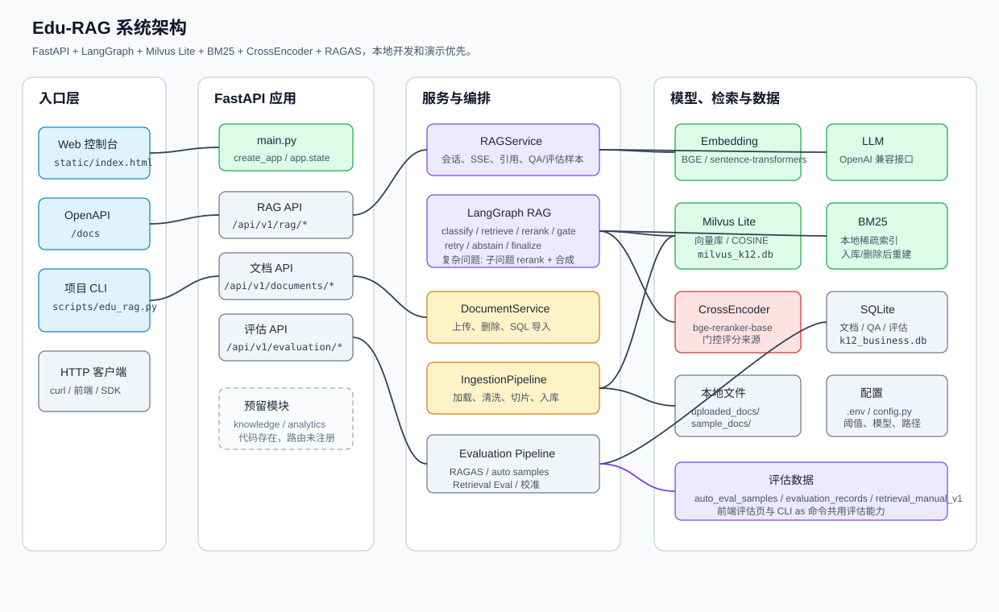
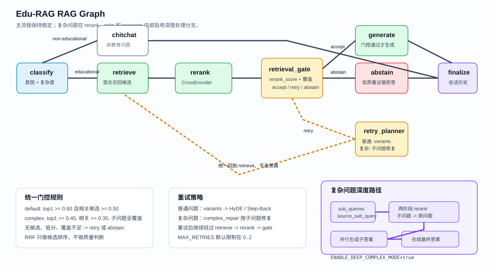

# Edu-RAG：K12 教育知识库问答系统

Edu-RAG 是一个面向 K12 教材、教辅和校本资料的本地 RAG 系统。它使用 **FastAPI** 提供 REST/SSE 接口，使用 **LangGraph** 编排问答流程，使用 **Milvus Lite + BM25 + RRF** 做混合召回，并通过 **CrossEncoder 重排 + 检索门控** 控制答案生成质量。项目还包含文档入库、SQL 导入、RAGAS 答案评估和独立检索评估。

当前应用版本：`1.0.0`，见 [main.py](main.py)。



---

## 目录

- [快速开始](#快速开始)
- [系统能力](#系统能力)
- [RAG Graph 流程](#rag-graph-流程)
- [文档入库流程](#文档入库流程)
- [命令行管理脚本](#命令行管理脚本)
- [HTTP API](#http-api)
- [配置说明](#配置说明)
- [评估体系](#评估体系)
- [数据与本地状态](#数据与本地状态)
- [测试与验证](#测试与验证)
- [代码结构](#代码结构)
- [生产化注意事项](#生产化注意事项)
- [常见问题](#常见问题)

---

## 快速开始

### 1. 准备环境

推荐 Python `3.11` 到 `3.13`。首次运行会下载 Embedding / Reranker 模型，国内网络建议在 `.env` 中保留：

```bash
HF_ENDPOINT=https://hf-mirror.com
```

项目默认读取 `.env`。当前 [.env.example](.env.example) 使用本地 Ollama 兼容 OpenAI 接口：

```bash
LLM_API_KEY=ollama
LLM_BASE_URL=http://localhost:11434/v1
LLM_MODEL=glm-4.7-flash
```

如果使用阿里百炼、OpenAI 或其它兼容服务，只需要改 `LLM_API_KEY`、`LLM_BASE_URL`、`LLM_MODEL`。

### 2. 用 CLI 初始化并启动

```bash
git clone <repository-url>
cd edu-rag

./edu-rag help
./edu-rag setup
./edu-rag start
```

启动完成后访问：

- Web 控制台：<http://localhost:8000/>
- OpenAPI 文档：<http://localhost:8000/docs>
- 健康检查：<http://localhost:8000/health>

### 3. 上传样例文档并提问

仓库自带 `sample_docs/`，适合新用户先走通入库和问答。

```bash
./edu-rag upload-samples --grade 七年级
./edu-rag list-docs
./edu-rag ask "一元一次方程怎么解？" --subject 数学 --grade 七年级
```

清理样例：

```bash
./edu-rag delete-samples
./edu-rag stop
```

### 4. 手动启动方式

如果不使用 CLI，也可以手动运行：

```bash
python -m venv .venv
source .venv/bin/activate
pip install -r requirements.txt
cp .env.example .env
python main.py
```

说明：`python main.py` 会先同步初始化 Milvus Lite 和 RAG Graph，再进入 Uvicorn。直接使用多 worker 或热重载时要注意 Milvus Lite 单文件数据库的单进程约束。

---

## 系统能力

| 能力 | 当前实现 |
|------|----------|
| 问答接口 | `POST /api/v1/rag/ask` 非流式问答，`POST /api/v1/rag/ask-stream` SSE 流式问答 |
| 会话隔离 | `session_id -> user_id -> UUID4`，LangGraph `thread_id` 按会话隔离 |
| 意图分类 | 教育问题进入 RAG；非教育问题进入 `chitchat` 分支 |
| 多策略召回 | `direct`、`multi_query`、`decomposition`，重试时使用 query variants / HyDE / Step-Back |
| 混合检索 | Milvus COSINE 稠密检索 + 本地 BM25 稀疏检索 + RRF 候选融合 |
| 重排与门控 | `BAAI/bge-reranker-base` CrossEncoder 懒加载；门控只使用 `[0,1]` 的 `rerank_score` |
| 低质量拒答 | 检索证据不足时不进入 LLM 生成，返回固定拒答提示 |
| 文档管理 | 上传 PDF / Markdown / TXT，列表查询，删除文档和对应向量 |
| SQL 导入 | 后端连接关系型数据库，流式读取、清洗、切片、入库 |
<!-- 暂未开发完成
| 学情分析 | 基于 QA 历史提供薄弱点、历史记录、推荐接口 |
| 知识点管理 | 提供知识点树、创建和删除接口 |
-->
| 评估 | RAGAS 答案质量评估 + 独立检索评估与门控阈值校准 |
| 本地管理 | `./edu-rag` 封装 help/setup/start/stop/restart/upload-samples 等常用操作 |

---

## RAG Graph 流程

当前主流程由 [core/graph.py](core/graph.py) 构建：



真实节点顺序：

```text
classify
  ├─ non-educational -> chitchat -> finalize
  └─ educational -> retrieve -> rerank -> retrieval_gate
                                      ├─ accept  -> generate -> finalize
                                      ├─ retry   -> retry_planner -> retrieve
                                      └─ abstain -> abstain -> finalize
```

关键实现点：

- `build_rag_graph(vector_store, reranker=None, checkpointer=None)` 通过闭包注入向量库和重排器，不把不可序列化对象塞进 Graph State。
- 默认使用 `MemorySaver` 做本地会话记忆，`RAGService` 使用 `session_id` 作为 LangGraph `thread_id`。
- `retrieve` 只负责召回候选，不判断质量。
- `rerank` 负责 CrossEncoder 重排；模型懒加载，推理通过 `asyncio.to_thread()` 避免阻塞事件循环。
- `retrieval_gate` 使用 [core/retrieval_quality.py](core/retrieval_quality.py) 的统一门控逻辑，只看 `rerank_score`，不再把 RRF 分数当作质量分。
- `MAX_RETRIES` 默认 `2`，配置层会限制在 `0..2`。
- SSE 流式响应中，Graph 任意节点异常都会发送 `error` 事件并最终发送 `done`，避免客户端永久等待。

默认门控规则：

| 条件 | 动作 |
|------|------|
| 重排器不可用且 `RETRIEVAL_GATE_MODE=enforce` | `abstain` |
| 无候选且仍有重试次数 | `retry` |
| `top1_score >= 0.60` 且存在 `rerank_score >= 0.50` 候选 | `accept` |
| 低分且仍有重试次数 | `retry` |
| 重试耗尽 | `abstain` |

拒答文案：

```text
抱歉，我暂时没有检索到足够可靠的资料来回答这个问题。你可以补充教材范围、年级或更具体的问题。
```

---

## 文档入库流程

文件入口在 [api/documents.py](api/documents.py)，服务实现是 [services/document_service.py](services/document_service.py)，流水线是 [ingestion/pipeline.py](ingestion/pipeline.py)。

```text
上传 PDF / Markdown / TXT
  -> 保存到 uploaded_docs/
  -> 创建 documents 记录
  -> loader 解析文件
  -> CleaningPipeline 清洗
  -> split_documents 切片
  -> Embedding 向量化
  -> Milvus Lite 写入
  -> BM25 重建
  -> 更新 documents 状态
```

SQL 导入入口是 `POST /api/v1/documents/import/sql`：

```text
SQLSourceAdapter
  -> 流式读取 rows
  -> 行转文本
  -> 清洗 / 切片 / 向量化
  -> Milvus + BM25
  -> documents 状态更新
```

支持的文件类型由接口限制为：`.pdf`、`.md`、`.txt`。

切片策略支持：`recursive`、`semantic`、`markdown`。具体实现见 [ingestion/chunker.py](ingestion/chunker.py)。

---

## 命令行管理脚本

本地命令入口是根目录的 [edu-rag](edu-rag)，底层实现位于 [scripts/edu_rag.py](scripts/edu_rag.py)，只依赖 Python 标准库。它适合新用户首次启动，也适合日常演示和排障。

| 命令 | 用途 |
|------|------|
| `./edu-rag help` | 查看所有可用操作 |
| `./edu-rag setup` | 创建 `.env`、`.venv` 并安装依赖 |
| `./edu-rag start` | 后台启动服务并等待 `/health` 就绪 |
| `./edu-rag stop` | 停止后台服务 |
| `./edu-rag restart` | 重启服务 |
| `./edu-rag status` | 查看 PID 和日志位置 |
| `./edu-rag health` | 调用健康检查接口 |
| `./edu-rag logs --lines 120` | 查看最近日志 |
| `./edu-rag logs -f` | 持续跟随日志 |
| `./edu-rag open` | 打开 Web 控制台 |
| `./edu-rag open --docs` | 打开 OpenAPI 文档 |
| `./edu-rag list-docs` | 查看文档列表 |
| `./edu-rag upload-samples` | 上传 `sample_docs/` 下的样例文档 |
| `./edu-rag delete-samples` | 删除由脚本上传的样例文档 |
| `./edu-rag ask "问题"` | 命令行提问 |
| `./edu-rag test` | 运行核心回归测试 |
| `./edu-rag eval-sample` | 校验 `data/test_sets/manual_v1.jsonl` |

脚本产生的本地状态放在 `.run/`：

- `.run/edu-rag.pid`
- `.run/edu-rag.log`
- `.run/sample-docs.json`

`.run/` 已写入 [.gitignore](.gitignore)，不会进入版本库。

---

## HTTP API

所有 API 都会在 `/docs` 中生成交互式文档。下面是代码中注册的主要路由：

| 方法 | 路径 | 说明 |
|------|------|------|
| `GET` | `/` | Web 控制台 |
| `GET` | `/health` | 健康检查，返回向量库统计和 LLM 配置状态 |
| `POST` | `/api/v1/rag/ask` | 非流式 RAG 问答 |
| `POST` | `/api/v1/rag/ask-stream` | SSE 流式 RAG 问答 |
| `POST` | `/api/v1/rag/feedback` | 对 QA 历史记录提交反馈 |
| `POST` | `/api/v1/documents/upload` | 上传 PDF / MD / TXT 并入库 |
| `POST` | `/api/v1/documents/import/sql` | 从 SQL 数据源导入 |
| `GET` | `/api/v1/documents/list` | 文档列表 |
| `DELETE` | `/api/v1/documents/{doc_id}` | 删除文档和对应向量 |
<!-- 暂未开发完成
| `GET` | `/api/v1/knowledge-points/tree` | 知识点树 |
| `POST` | `/api/v1/knowledge-points/` | 创建知识点 |
| `DELETE` | `/api/v1/knowledge-points/{kp_id}` | 删除知识点 |
| `GET` | `/api/v1/analytics/weak-points/{user_id}` | 薄弱点分析 |
| `GET` | `/api/v1/analytics/history/{user_id}` | QA 历史 |
| `GET` | `/api/v1/analytics/recommend/{user_id}` | 推荐复习内容 |
-->
| `POST` | `/api/v1/evaluation/from-history` | 从历史 QA 运行 RAGAS 评估 |
| `POST` | `/api/v1/evaluation/from-content` | 上传或粘贴测试集并实时评估 |
| `POST` | `/api/v1/evaluation/from-file` | 从服务器本地测试集文件评估 |
| `POST` | `/api/v1/evaluation/live` | 给定问题列表，实时问答后评估 |
| `GET` | `/api/v1/evaluation/history` | 评估历史列表 |
| `GET` | `/api/v1/evaluation/history/{record_id}` | 单条评估详情 |

非流式问答示例：

```bash
curl -X POST http://localhost:8000/api/v1/rag/ask \
  -H "Content-Type: application/json" \
  -d '{
    "query": "一元一次方程怎么解？",
    "subject": "数学",
    "grade": "七年级",
    "user_id": "demo",
    "session_id": "demo-session"
  }'
```

上传文档示例：

```bash
curl -X POST http://localhost:8000/api/v1/documents/upload \
  -F "file=@sample_docs/教材_数学_一元一次方程.md" \
  -F "subject=数学" \
  -F "grade=七年级" \
  -F "chapter=一元一次方程" \
  -F "strategy=recursive"
```

---

## 配置说明

配置入口是 [config.py](config.py)，`.env` 会在导入配置时自动加载。常用变量如下：

| 变量 | 默认值 / 示例 | 说明 |
|------|---------------|------|
| `LLM_API_KEY` | `.env.example` 为 `ollama` | OpenAI 兼容接口密钥 |
| `LLM_BASE_URL` | `.env.example` 为 `http://localhost:11434/v1` | OpenAI 兼容接口地址 |
| `LLM_MODEL` | `.env.example` 为 `glm-4.7-flash` | 生成模型 |
| `LLM_MAX_CONTEXT_TOKENS` | `8192` | 生成节点会裁剪历史和上下文，避免超过窗口 |
| `RAGAS_LLM_MAX_TOKENS` | `8192` | RAGAS 结构化输出上限 |
| `K12_MILVUS_URI` | `./milvus_k12.db` | Milvus Lite 本地数据文件 |
| `DATABASE_URL` | `sqlite+aiosqlite:///.../k12_business.db` | SQLite 业务库 |
| `UPLOAD_DIR` | `uploaded_docs/` | 上传文档落盘目录 |
| `EMBEDDING_MODEL` | `BAAI/bge-small-zh-v1.5` | Embedding 模型 |
| `EMBEDDING_DEVICE` | `cpu` | Embedding 设备 |
| `ENABLE_RERANKER` | `true` | 是否启用本地 CrossEncoder |
| `RERANKER_MODEL` | `BAAI/bge-reranker-base` | 重排模型 |
| `RERANKER_DEVICE` | `cpu` | 重排设备 |
| `RETRIEVAL_CANDIDATE_TOP_K` | `20` | 检索候选数 |
| `GENERATION_CONTEXT_TOP_K` | `5` | 生成节点使用的上下文数 |
| `RERANKER_RELEVANCE_THRESHOLD` | `0.50` | 候选相关性阈值 |
| `RETRIEVAL_ACCEPT_TOP1_THRESHOLD` | `0.60` | top1 接受阈值 |
| `RETRIEVAL_GATE_MODE` | `enforce` | `enforce` 强制门控，`observe` 观察放行 |
| `MAX_RETRIES` | `2` | 检索重试次数，代码限制为 `0..2` |
| `APP_HOST` | `0.0.0.0` | 服务监听地址 |
| `APP_PORT` | `8000` | 服务端口 |
| `LOG_LEVEL` | `INFO` | 日志级别 |

注意：项目故意使用 `K12_MILVUS_URI`，不要改成通用的 `MILVUS_URI`，因为 `pymilvus` 也会读取该环境变量，容易冲突。

---

## 评估体系

项目有两条评估线。

### RAGAS 答案质量评估

代码位于：

- [evaluation/pipeline.py](evaluation/pipeline.py)
- [evaluation/ragas_evaluator.py](evaluation/ragas_evaluator.py)
- [evaluation/dataset_builder.py](evaluation/dataset_builder.py)

常用命令：

```bash
python evaluation/cli.py validate --file data/test_sets/manual_v1.jsonl
python evaluation/cli.py evaluate --from-file evaluation/sample_test.json
python evaluation/cli.py evaluate --from-file data/test_sets/manual_v1.jsonl --live
python evaluation/cli.py export --min-feedback 1 --limit 50
```

RAGAS 结果默认写入 `evaluation_records` 表，前端和 API 都能查看历史。

### 检索评估与门控校准

代码位于 [evaluation/retrieval_evaluator.py](evaluation/retrieval_evaluator.py)。这条线不调用答案生成，只评估召回、排序、门控、重试收益和延迟。

标注格式示例见 [data/test_sets/retrieval_manual_v1.example.jsonl](data/test_sets/retrieval_manual_v1.example.jsonl)：

```json
{
  "id": "math-001",
  "question": "一元二次方程如何求根？",
  "subject": "数学",
  "grade": "九年级",
  "complexity": "simple",
  "answerable": true,
  "relevant_chunk_ids": [101, 102],
  "tags": ["algebra"]
}
```

命令：

```bash
python evaluation/cli.py retrieval-evaluate \
  --from-file data/test_sets/retrieval_manual_v1.jsonl

python evaluation/cli.py retrieval-calibrate \
  --from-file data/test_sets/retrieval_manual_v1.jsonl \
  --max-false-accept-rate 0.05
```

报告包含：`Recall@5/10/20`、`Precision@5`、`MRR@10`、`nDCG@10`、错误接受率、错误拒绝率、拒答准确率、重试恢复率、检索/重排/总链路延迟，以及按学科、年级、复杂度、策略、重试次数的切片。

---

## 数据与本地状态

| 路径 / 表 | 说明 |
|-----------|------|
| `milvus_k12.db` | Milvus Lite 向量库文件，路径由 `K12_MILVUS_URI` 控制 |
| `k12_business.db` | SQLite 业务库 |
| `uploaded_docs/` | 上传文档的落盘副本 |
| `.run/` | CLI 产生的 PID、日志和样例上传清单 |
| `sample_docs/` | 随仓库提供的演示文档 |
| `data/test_sets/manual_v1.jsonl` | RAGAS / live eval 人工测试集 |
| `data/test_sets/retrieval_manual_v1.example.jsonl` | 检索评估标注格式示例 |
| `data/intent_training_data.jsonl` | 意图分类结果收集文件 |

SQLite 主要表：

| 表 | 说明 |
|----|------|
| `documents` | 文档元数据、入库状态、切片数量 |
<!-- `knowledge_points` 暂未开发完成 -->
| `qa_records` | 问答历史、引用、反馈、延迟 |
| `evaluation_records` | RAGAS 评估记录 |

---

## 测试与验证

核心测试命令：

```bash
./edu-rag test
```

更完整的本地验证：

```bash
.venv/bin/python test/test_cleaner.py --unit-only
.venv/bin/python test/test_strategies.py --unit-only
.venv/bin/python test/test_refactor_smoke.py
.venv/bin/python test/test_retrieval_v1.py
.venv/bin/python test/test_graph_v1.py
.venv/bin/python test/test_retrieval_evaluation.py
.venv/bin/python test/test_project_cli.py
.venv/bin/python -m compileall -q main.py config.py api services core ingestion evaluation models test utils scripts
```

服务 smoke：

```bash
./edu-rag start
./edu-rag health
./edu-rag open --docs
./edu-rag upload-samples --grade 七年级
./edu-rag ask "浮力是什么？" --subject 物理
./edu-rag stop
```

---

## 代码结构

```text
edu-rag/
├── main.py                         # FastAPI app factory、运行时初始化、/health
├── config.py                       # 环境变量配置
├── api/                            # FastAPI 路由
│   ├── rag.py                      # 问答、SSE、反馈
│   ├── documents.py                # 上传、SQL导入、列表、删除
│   ├── evaluation.py               # RAGAS API
<!--   ├── analytics.py                # 学情接口（暂未开发完成）-->
<!--   └── knowledge.py                # 知识点接口（暂未开发完成）-->
├── services/                       # 应用服务层
│   ├── rag_service.py              # 会话、Graph 调用、SSE、QA记录
│   ├── document_service.py         # 文档保存、入库、删除
<!--   ├── analytics_service.py        # 学情分析（暂未开发完成）-->
<!--   └── knowledge_service.py        # 知识点管理（暂未开发完成）-->
├── core/                           # RAG 核心
│   ├── graph.py                    # LangGraph 编排
│   ├── vectorestore.py             # Milvus + BM25 + RRF
│   ├── reranker.py                 # CrossEncoder 重排器
│   ├── retrieval_quality.py        # 检索门控
│   ├── state.py                    # RAGState
│   ├── stream_queue.py             # SSE token 队列注册表
│   ├── nodes/                      # 分类、生成、闲聊、训练收集等节点
│   └── strategies/                 # multi-query、decomposition、HyDE、Step-Back
├── ingestion/                      # 文档加载、清洗、切片、入库流水线
├── evaluation/                     # RAGAS、检索评估、CLI
├── models/                         # SQLAlchemy ORM 与 Pydantic Schema
├── edu-rag                         # 根目录命令入口
├── scripts/edu_rag.py              # 本地项目管理 CLI
├── static/index.html               # Web 控制台
├── sample_docs/                    # 演示文档
├── data/test_sets/                 # 测试集与评估样例
└── test/                           # 回归测试
```

---

## 生产化注意事项

当前项目适合本地开发、演示、中小规模单机知识库和工程验证。生产环境需要额外补齐：

- 认证、授权、租户隔离和审计日志。
- Milvus Lite 到 Milvus 服务/集群形态的迁移方案。
- SQLite 到 PostgreSQL / MySQL 的迁移和连接池配置。
- 向量库、业务库、上传文件和模型缓存的备份策略。
- SQL 导入的更严格安全策略，尤其是 `where_clause` 的准入边界。
- Reranker 与 Embedding 模型的冷启动、缓存和 GPU/CPU 容量规划。
- 线上指标：拒答率、错误接受率、重试恢复率、延迟分位数、SSE 中断率。
- 标注集治理：检索评估需要真实 `chunk_id`，示例文件不能直接代表线上质量。

---

## 常见问题

### `/health` 返回 unhealthy

常见原因：

- Milvus Lite 文件被其它进程占用。
- 上次异常退出后留下 `.milvus*.db.lock`。
- Embedding 模型下载失败。

排查：

```bash
./edu-rag status
./edu-rag logs --lines 160
```

确认没有服务进程后，再处理残留 lock 文件。

### 首次启动很慢

通常是下载 Embedding 或 Reranker 模型。国内网络请确认：

```bash
HF_ENDPOINT=https://hf-mirror.com
```

### 上传样例后问答仍然拒答

当前门控默认是 `enforce`。如果检索证据不足或重排器不可用，系统会拒答。可以先检查：

```bash
./edu-rag list-docs
./edu-rag logs --lines 120
```

共享演示环境可以临时设置：

```bash
RETRIEVAL_GATE_MODE=observe
```

但正式评估时建议使用 `enforce`，并用检索标注集校准阈值。

### `uvicorn main:app --reload` 与 `python main.py` 有什么区别

`python main.py` 会显式先构建运行时对象，再启动 Uvicorn，更适合 Milvus Lite 单文件模式。`uvicorn main:app --reload` 可以用于调试接口和前端，但要注意热重载可能触发重复初始化。

### 如何重置本地数据

先停止服务，再按需备份和删除本地状态：

```bash
./edu-rag stop
```

可清理对象包括：

- `uploaded_docs/`
- `milvus_k12.db`
- `k12_business.db`
- `.run/`

删除数据库或向量库会丢失已入库文档、QA 历史和评估记录。
